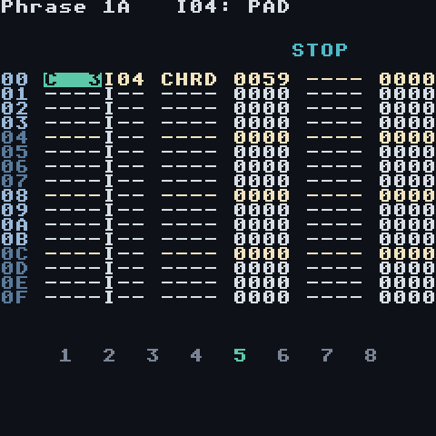
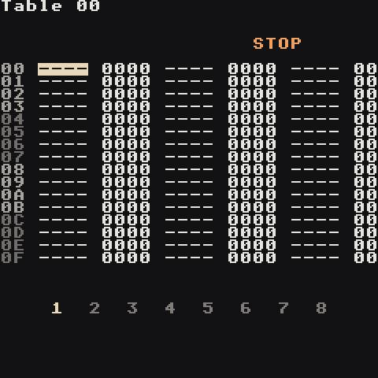

# Commands

Commands live in the two command columns of a phrase and the three columns of a table. Each is four letters plus a 4-digit hex value, usually written `aabb`. Put the cursor on a `----` column and press **Select** to pick from the list.



**Where it goes matters:**

- On the same step as a note, a command shapes that note.
- On a step without a note, it changes whatever is already playing on that track.
- A note **with** an instrument number resets that instrument's ramps. A note **without** one (`I--`) keeps sweeps and fades running.

Timing: 1 step = 6 ticks at the default groove. Ramp speeds (`aa`) count in groups of ticks — bigger `aa` = slower.

<br clear="right">

## The ones you'll use every day

| Command | Value | Does | Try |
| --- | --- | --- | --- |
| `VOLM` | `aabb` | volume to `bb`, ramping over `aa` (`00` = instant) | `VOLM 0050` ghost note · `VOLM 4000` slow fade out |
| `KILL` | `--bb` | stop the note after `bb` ticks | `KILL 0000` cut now · `KILL 0003` half a step |
| `CHRD` | `abcd` | turn the note into a chord: the note picks **which** chord, the value picks **what kind** (each digit = also play the note that many steps up) | `A 2` + `0037` = A minor · `C 3` + `0047` = C major |
| `ARPG` | `abcd` | cycle root, +a, +b, +c, +d every tick | `ARPG 0047` chiptune major |
| `RTRG` | `aabb` | retrigger every `bb` ticks | `RTRG 0003` 32nd roll · `RTRG 0002` tremolo |
| `PTCH` | `aabb` | bend to `bb` semitones (signed) at speed `aa` | `PTCH 1002` up 2 · `PTCH 10FE` down 2 |
| `LEGA` | `aabb` | slide into the note from `bb` semitones away | `LEGA 10F4` slide up from an octave below |
| `FCUT` | `aabb` | filter cutoff to `bb` at speed `aa` | `FCUT 60C0` open over ~4 bars |
| `FRES` | `aabb` | filter resonance to `bb` at speed `aa` | `FRES 00C0` squelch now |
| `PAN ` | `aabb` | pan to `bb` (`00` left, `7F` centre, `FE` right) | `PAN 2000` sweep left |
| `DLAY` | `--bb` | start the note `bb` ticks late (up to the step's length) | `DLAY 0003` push a note behind the beat |

## Randomness

Two commands that make every pass a little different, as on the M8:

| Command | Value | Does | Try |
| --- | --- | --- | --- |
| `RAND` | `00bb` | adds a random amount, up to `bb`, to the **other command** on the same step. On its own it moves the **note** up to `bb` semitones, staying in the song's Key/Scale | `VOLM 0060` + `RAND 0060`: velocity between 60 and C0 · `FCUT 0040` + `RAND 0080`: a wandering filter · `RAND 000C` alone: a new melody every loop |
| `CHNC` | `00bb` | the note plays with a chance of `bb`/`FF` (`FF` always, `80` half the time, `00` never) | ghost hats with `CHNC 0060` · a fill that only sometimes happens |

Put them on a step with a note. Both can go on one step (`CHNC` in one column, `RAND` in the other).

Random numbers are drawn per track. `SEED` (below) makes them repeat.

## From the M8

Sequencer commands after the Dirtywave M8's (`RET`, `NTH`, `SED`, `PVB`, `TIC`, `THO`, `TSP`, `SCG`). They work the same with synth, sample and MIDI instruments, because the sequencer runs them. `ROLL`, `VIBR`, `SEED`, `NTH`, `TRSP` and `SCAL` go in a phrase; `TICK` and `THOP` also work inside a table.

| Command | Value | Does | Try |
| --- | --- | --- | --- |
| `ROLL` | `--xy` | strike the note again every `y` ticks until the next note. Each hit changes the volume by `x`: `1`-`7` quieter (`x`×8 per hit, the roll stops when it reaches silence), `9`-`F` louder (`(x-8)`×8), `0`/`8` steady. The first hit starts from the step's `VOLM`, or the instrument's volume. `y`=0: one extra hit, `x` ticks later. `0000` stops | `ROLL 0003` snare roll · `VOLM 0020` + `ROLL 00F2` a roll that swells in · `ROLL 0043` echoing stutter · `ROLL 0030` flam |
| `VIBR` | `--xy` | vibrato: speed `x` (a cycle every 64/`x` ticks, so it follows the tempo), depth `y` sixteenths of a semitone. Ends with `VIBR 0000` or the next note with an instrument number | `VIBR 0048` singer's vibrato · `VIBR 00C3` fast shimmer on a pad |
| `SEED` | `--bb` | restart this track's random numbers from seed `bb`: every `RAND` and `CHNC` after it comes out the same each time. Put it on step 0 to freeze a random melody you like | `SEED 0007` on step 0 + `RAND 000C` on every step: one "random" tune that loops. Change `bb` for another |
| `NTH ` | `--xy` | the note plays only on pass `x` of every `y` times its phrase plays on this track (passes count from when you press Start). `x`=0: on every pass except each `y`-th | `NTH 0014` a crash only on the first of 4 bars · `NTH 0044` a fill on the 4th · `NTH 0002` a hat that skips every other bar |
| `TICK` | `--bb` | this track's table moves one row every `bb` ticks instead of every tick (in a table: that table's own speed). `0000` goes back to the groove | `TABL 0003` + `TICK 0006` a table that steps once per step, like a slow arpeggio |
| `THOP` | `--0b` | this track's table jumps to row `b`, all three columns (in a table: jump there on this row) | restart a filter sweep half way through a phrase |
| `TRSP` | `--bb` | transpose the whole song by `bb` semitones (`01`-`30` up, `FF`-`D0` down), like Project → `Transpose` | `TRSP 0002` up a tone for the last chorus · `TRSP 00F4` an octave down |
| `SCAL` | `aabb` | set the song's Key to `aa` (`00` C … `0B` B, `0C` no key) and its Scale to number `bb` (the order on the Scale screen: `15` major, `03` minor, `20` minor pentatonic, `2E` your Custom scale). Note editing and `RAND` follow it from then on | `SCAL 0915` A major for a bridge, back with `SCAL 0003` |

`TRSP` and `SCAL` change the song's settings, the same way `TMPO` sets the tempo: the song keeps them when it stops.

A `ROLL` on a step with a note re-strikes that note; on a step without one it re-strikes whatever is still ringing. The random numbers `SEED` restarts belong to its track only, so a seeded bassline doesn't freeze the drums' `CHNC`.

## Song-level

| Command | Value | Does |
| --- | --- | --- |
| `TMPO` | `--bb` | set tempo to `bb` (hex BPM) |
| `GROV` | `--bb` | switch this track to groove `bb` |
| `TABL` | `--bb` | start table `bb` on this track |
| `HOP ` | `--bb` | when the phrase reaches this step, go on to the next phrase at its step `bb` (a 12-step bar: `HOP 0000` on step `C`). `HOP 00FF` stops the track there. In a table: jump to row `bb`, `aa` times |
| `STOP` | `----` | stop the song |

## Sound shaping

| Command | Value | Does |
| --- | --- | --- |
| `FLTR` | `aabb` | set cutoff `aa` and resonance `bb` instantly |
| `PFIN` | `aabb` | fine pitch toward `bb` |
| `CRSH` | `aa-b` | drive `aa`, bit crush `b` (samples); synths use `aa` as drive |

## Samples only

| Command | Value | Does |
| --- | --- | --- |
| `PLAY` | `00bb` | play mode for this note: `00` forward, `01` reverse, `02` loop, `03` rev-loop, `04` pingpong, `05` rev-pingpong, `06`-`08` osc, `09` loop-sync ([play modes](Samples#play-modes)). With a note: the note starts over in that mode (reverse from E); without: the sound turns around from where it is |
| `PLOF` | `aabb` | jump to position `aa`/256 of the sample, or move by `bb` chunks |
| `LPOF` | `aaaa` | shift the loop window (wavetable scanning, stretch) |
| `SLCE` | | pick a slice |
| `FBMX` / `FBTN` | `aabb` | feedback mix / tune |
| `IRTG` | `aabb` | retrigger and transpose |

## MIDI

| Command | Does |
| --- | --- |
| `MDCC` | send MIDI CC `aa` with value `bb` |
| `MDPG` | send program change |
| `MVEL` | set note velocity |

## Tables: commands that play themselves



A table is a little 16-row loop of commands that advances one row per tick. Point an instrument at it (Instrument → synth LFO page or sample Motion page → `table`, `auto`) or start it from a phrase with `TABL`.

Example — a trance gate on a pad:

```text
00  VOLM 00FF
01  VOLM 0000
02  HOP  0000   (jump back to row 00)
```

Example — a slow arpeggio, one row per step (`TICK` in the table itself):

```text
00  PTCH 0000   TICK 0006
01  PTCH 000C
02  PTCH 0007
03  HOP  0000
```

Example — a fast octave, root, fifth arpeggio:

```text
00  PTCH 000C
01  PTCH 0000
02  PTCH 0007
03  HOP  0000
```
