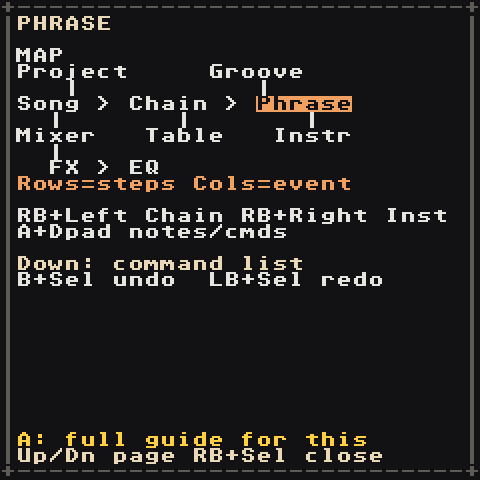

# Controls

The RG Nano has few buttons, so the same few combos mean the same thing on every screen. Learn these rules once:

| Keys | Always means |
| --- | --- |
| **D-pad** | move the cursor |
| **A** | add / paste / press the thing under the cursor |
| **A + D-pad** | change the value (Left/Right small step, Up/Down big step) |
| **B + A** | delete it, or put a knob back to its default |
| **A + Start** | hear the instrument (on a phrase, **A** on a note already previews it) |
| **B + D-pad** | jump to the neighbouring item that way (chain, phrase, instrument, table, groove; 16 rows on the Song) |
| **B** | back / close, in dialogs (right away) |
| **Left/Right** in a list | a page at a time (where Left/Right pick a button instead: **LB + Up/Down**) |
| **RB + D-pad** | go to the screen that way on the map |
| **Start** | play / stop what this screen shows |
| **RB + Start** | play / stop the whole song (on the Song screen in Live mode: stop this track) |
| **LB + Start** | capture or launch: record this bar/chain into a sample, or on the Song launch the row live |
| **LB + D-pad** | the finer or alternate move (chromatic note, instrument page, trim marker, song section) |
| **B + RB** / **A + RB** | mute / solo the track; **RB + LB** unmutes all |
| **B + LB** | start a selection (again: grow it to whole rows, then the whole block). In a selection **B** copies, **A + LB** cuts, **A + D-pad** changes every selected value; without one, **A + LB** pastes |
| **Select** | this screen's special tool: command picker, Live mode, sample import/root, rename, sort |
| **B + Select** / **LB + Select** | undo / redo any change, on every screen (hold B or LB first) |
| **RB + Select** | the helper, on every screen |

Nothing is mapped twice on a screen, and a combo never fires two actions at once.

> On the RG Nano, **Select** is the `FN` button. **LB/RB** are the shoulder buttons. The Menu/Power button opens the app menu: **Volume** and **Brightness** (Left/Right), **Save and quit**, **Quit, don't save** (asks first) and **Debug tools**. Holding power to switch off saves your song first.

## Moving between screens

Hold **RB** and press a direction:

| From | RB + Right | RB + Left | RB + Up | RB + Down |
| --- | --- | --- | --- | --- |
| Song | Chain under the cursor | — | Project | Mixer |
| Chain | Phrase under the cursor | Song | — | — |
| Phrase | Instrument of the note | Chain | Groove | Table |
| Instrument | — | Phrase | list of all sounds | Instrument table |
| Table | Instrument table | Table (from the instrument table) | back up | — |
| Groove | — | — | — | Phrase |
| Project | — | — | — | Song |
| Mixer | — | — | Song | FX |
| FX | EQ | — | Mixer | — |
| EQ | — | FX | — | — |

If a cell is empty, RB + Right tells you to press **A** first. Holding RB + a direction moves one screen, however long you hold it.

 

## Everywhere

| Input | Does |
| --- | --- |
| **Start** | play / stop (what plays depends on the screen, see below) |
| **RB + Start** | play / stop the whole song from a Chain, Phrase, Table, Groove or Instrument screen |
| **RB + Select** | helper: **Down/Up** flips map → commands → how-to, **A** opens the full guide, **RB + Select** closes |
| **B + Select** / **LB + Select** | undo / redo (32 steps; one A-hold of edits is one step) |
| **A + RB** | solo the track (Song, Chain, Phrase, Mixer) |
| **B + RB** | mute the track (Song, Chain, Phrase, Mixer) |
| **B + LB** | start a selection; **B** copies it, **A + LB** pastes |

The small label at the top right says what is playing: `PLAY:SONG`, `PLAY:CHAIN`, `PLAY:PHR`, `PLAY:LIVE`, `AUDITION` or `STOP`.

## Song

| Input | Does |
| --- | --- |
| D-pad | move between rows (time) and the 8 tracks |
| **A** on `--` | put the last-used chain here (screen says `Reused 00`) |
| **A** again | replace it with a brand-new empty chain (`New chain 01`) |
| **A + D-pad** | change the chain number |
| **B + A** | delete the chain from this cell |
| **B + Up/Down** | 16 rows up / down |
| **LB + Up/Down** | jump through song sections |
| **LB + Left/Right** | nudge the tempo |
| **Start** | play the song from this row |
| **B + Start** | while playing, jump every track to this row right away |
| **Select** | switch to **Live mode** and back (see below) |

## Live mode

Jam with your song: loop sections, bring parts in and out, switch sections on the beat. **Select** on the Song screen switches Song ↔ Live; the title says which, and the buttons are listed at the bottom of the screen.

| Input (Live) | Does |
| --- | --- |
| **Start** on a cell | cue that chain on its track: it starts when the track's current chain ends, then loops. Press twice to switch at the next bar instead |
| **LB + Start** | cue the whole row: every track switches to this section together |
| **RB + Start** | cue a stop for this track (twice: stop at the next bar) |
| **B + Start** | stop everything now |
| **B + RB** / **A + RB** | mute / solo a track while it plays |

A cued cell blinks in green until it starts. A track keeps looping its chain until you cue something else, so you can leave the drums on the verse while the bass moves to the chorus. **LB + Start** also switches to Live by itself. The Mixer, and Start on any other screen, work as usual.

## Chain

| Input | Does |
| --- | --- |
| **A** on `--` | put the last phrase here; **A** again for a new empty phrase |
| **A + D-pad** | change phrase number, or transpose (second column) |
| **B + D-pad** | jump to the next/previous chain |
| **Start** | play this track's chain on a loop |
| **LB + Start** | record the chain into a new sample ([render to sample](Samples#render-to-sample)) |

## Phrase

| Input | Does |
| --- | --- |
| **A** on an empty step | add a note (copies the last note and instrument) |
| **A + Left/Right** | note down/up a semitone (or a scale step if a key is set) |
| **A + Up/Down** | note down/up an octave |
| **LB + D-pad** on a note | chromatic edit that ignores the key/scale |
| **A + D-pad** on the `I` column | pick the instrument |
| **Select** on a command column | open the command picker |
| **A + Up/Down** on a command | step through the commands A to Z |
| **A + Left/Right** on a command | step through the commands in list order |
| **B + A** | delete |
| **B + D-pad** | jump to the neighbouring phrase |
| **Start** | loop this bar |
| **LB + Start** | record this bar into a new sample ([render to sample](Samples#render-to-sample)) |

With a selection (**B + LB**, then move to grow it), **LB + D-pad** writes for you:

| Input | Does |
| --- | --- |
| **LB + Right** | random notes in the song's Key/Scale, keeping the rhythm (no notes selected: random notes on random steps). Again for another roll |
| **LB + Left** | fill: repeat the first selected note on every step; again for every 2nd, 4th, 8th step |
| **LB + Up** | shuffle the selected steps |
| **LB + Down** | reverse them |

Didn't like it? **B + Select** undoes.

## Instrument

| Input | Does |
| --- | --- |
| **LB + Left/Right** | change page (SOUND, ENV, FILTER, LFO, MOD, MIX for synths) |
| **A + Left/Right** on `preset` | browse ready-made sounds |
| **A + D-pad** | change the focused knob |
| **B + Left/Right** | previous / next instrument (**B + Down/Up**: 16 forward / back) |
| **B + A** | put the knob back to its default (on `sample`: remove the sample; on `table`: clear it) |
| **RB + Up** | the list of all sounds |
| **Start** | play / stop the phrase, same as the Phrase screen |
| **A + Start** | hear the instrument (synth at C3, sample at its root); again to stop |
| **RB + A + Left/Right** | hear it an octave down / up |

Sample instruments have their own pages and trim controls — see [Samples](Samples).

## Mixer, FX and EQ

| Input | Does |
| --- | --- |
| **Left/Right** | pick a strip (Mixer) |
| **Up/Down** | pick a knob (FX, EQ) |
| **A + Up/Down** / **A + Left/Right** | big / small step |
| **B + A** | back to default (fader to `C0`, master to 100, knob to its default) |
| **B + RB** / **A + RB** | mute / solo the track (Mixer); **RB + LB** unmutes all |
| **Start** | play / stop the song |

## Naming a new song

The letters are in alphabetical order (not QWERTY), so the next letter is always one press away.

| Input | Does |
| --- | --- |
| D-pad | move over the keys and the `abc RANDOM CANCEL DONE` row (Down from the buttons wraps to the top letters) |
| **A** on `abc` / `ABC`, or **Select** | switch the keys to lowercase / uppercase |
| **A** | type the letter / run the button |
| **B** | erase a letter; on an empty name, leave without making a song |
| **LB / RB** | move the cursor inside the name |
| **Start** or `DONE` | create the song |

The suggested random name is highlighted: the first letter you type replaces it. `name taken` means a song with that name already exists.
