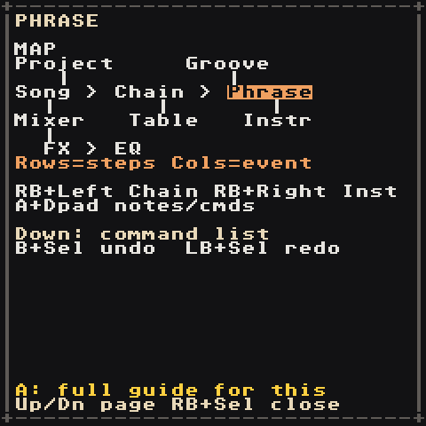

# Controls

The RG Nano has few buttons, so the same few combos mean the same thing on every screen. Learn these rules once:

| Keys | Always means |
| --- | --- |
| **D-pad** | move the cursor |
| **A** | add / paste / press the thing under the cursor |
| **A + D-pad** | change the value (Left/Right small step, Up/Down big step) |
| **B + A** | delete it, or put a knob back to its default |
| **A + Start** | hear the instrument (on a phrase, **A** on a note already previews it) |
| **B + D-pad** | jump to the neighbouring item that way (chain, phrase, instrument, table, groove; 16 rows on the Song) |
| **B** | back one step: closes whatever is open (dialog, list, menu, question, helper, folder), right away and without changing anything. See [Backing out](#backing-out) |
| **Left/Right** in a list | a page at a time (where Left/Right pick a button instead: **LB + Up/Down**) |
| **RB + D-pad** | go to the screen that way on the map |
| **Start** | play / stop what this screen shows |
| **RB + Start** | play / stop the whole song (on the Song screen in Live mode: stop this track) |
| **LB + Start** | capture or launch: record this bar/chain into a sample, or on the Song launch the row live |
| **LB + D-pad** | the finer or alternate move (chromatic note, instrument page, trim marker, MOD slot, song section or bookmark) |
| **B + RB** / **A + RB** | mute / solo the track; **RB + LB** unmutes all |
| **X** | copy what's under the cursor, or the selection. See [Copy and paste](#copy-and-paste) |
| **Y** | paste it. With nothing copied (Song, Chain): a new copy of the chain or phrase under the cursor in the next empty row |
| **LB + Y** | make new ones: paste new copies instead of the same chains/phrases again; on a Phrase, Table, Groove or Instrument, duplicate the one you're in |
| **B + LB** | start a selection; move to grow it, or hold **LB** and tap **B** to grow it to whole rows, then the whole block. In a selection **B** (or **X**) copies, **A + LB** cuts, **A + D-pad** changes every selected value; without one, **A + LB** pastes |
| **Select** | this screen's special tool: command picker, Live mode, sample import/root/editor, rename, sort |
| **A + Select** | mark it: bookmark the Song row |
| **B + Select** / **LB + Select** | undo / redo any change, on every screen (hold B or LB first) |
| **RB + Select** | the helper, on every screen |

Nothing is mapped twice on a screen, and a combo never fires two actions at once.

> On the RG Nano, **Select** is the `FN` button. **LB/RB** are the shoulder buttons. **X** and **Y** are the left and top face buttons (next to **B** and **A**). The Menu/Power button opens the app menu: **Volume** and **Brightness** (Left/Right), **Save and quit**, **Quit, don't save** (asks first) and **Debug tools**. Holding power to switch off saves your song first.

## Backing out

One rule for leaving anything: **B goes back one step.** Whatever you opened (a dialog, a list, a menu, a question, the helper, a folder), **B** closes it and puts you back exactly where you were, the moment you press it. It never saves, deletes, quits or changes anything on the way out; press it again to go back another step.

| Where | B does |
| --- | --- |
| Any dialog (instrument list, command picker, sample editor, render) | closes it; the command picker puts back the command you had |
| A question (`Save your work?`, `Delete ... ?`, `Purge ...?`) | closes it with no answer: nothing is saved, deleted or left. To answer **No**, pick `No` and press **A** |
| The helper (**RB + Select**) | closes it (so does **RB + Select** again) |
| A folder (sample browser, song list) | back up one folder; in the sample browser's top folder, closes it. The song list is the first screen, so there **B** just reminds you that Power quits |
| Power menu | its question → the menu → closed; **Debug tools** → the menu. **Power** closes the whole menu from anywhere |
| Recording | a take (recording or recorded) is dropped for another try; then the device list; then closed |
| Naming a song or sound | the one place **B** is a backspace: it erases the last letter you typed. With nothing typed (or only the suggested name) it leaves |
| The full guide | back through the pages you came through; **RB + Select** closes it from anywhere |
| The Rack | back to the Song (the Rack is a list you opened from there); in its sound browser, **B** puts the slot back as it was |

On the editing screens (Song, Chain, Phrase, Instrument ...) nothing is open to close, so **B** alone does nothing there: it is the modifier for **B + A** (delete), **B + D-pad** (jump) and **B + LB** (select). In a selection, **B** copies it and ends it.

## Moving between screens

Hold **RB** and press a direction:

| From | RB + Right | RB + Left | RB + Up | RB + Down |
| --- | --- | --- | --- | --- |
| Song | Chain under the cursor | [Rack](#rack): all your sounds | Project | Mixer |
| Rack | Instrument (edit the sound) | — | — | Phrase, to write notes with the sound |
| Chain | Phrase under the cursor | Song | — | — |
| Phrase | Instrument of the note | Chain | Groove | Table |
| Instrument | — | Phrase (or the Rack, if you came from it) | list of all sounds | Instrument table |
| Table | Instrument table | Table (from the instrument table) | back up | — |
| Groove | — | — | — | Phrase |
| Project | Scale | — | — | Song |
| Scale | — | Project | — | — |
| Mixer | — | — | Song | FX |
| FX | EQ | — | Mixer | — |
| EQ | Limit | FX | — | — |
| Limit | — | EQ | — | — |

If a cell is empty, RB + Right tells you to press **A** first. Holding RB + a direction moves one screen, however long you hold it.

 

## Copy and paste

**X** copies, **Y** pastes, on every screen that has something to copy. Each screen keeps its own copy, and the screen says what happened (`Copied chain 03`, `New phrase 07 = copy of 03`). Every paste can be undone with **B + Select**.

"The same" or "new": a Song cell only points at a chain, and a Chain row at a phrase. **Y** pastes the pointer, so both places play (and change with) the same chain. **LB + Y** makes new ones: fresh chains and phrases with the same notes, so you can edit the copy and leave the original alone.

| Screen | **X** | **Y** | **LB + Y** |
| --- | --- | --- | --- |
| Song | copies the chain (or selection) | paste it here, rows below move down. Nothing copied: a new copy of this chain (with new phrases) in the next empty row below, and the cursor goes there | paste new copies (new chains with new phrases) |
| Chain | copies the phrase or transpose (or selection) | paste it here. Nothing copied: a new copy of this row's phrase in the next empty row below | paste new copies (new phrases) |
| Phrase | copies the step (or selection) | paste it here | duplicate this phrase into the chain's next empty row and open it |
| Table | copies the step (or selection) | paste it here | duplicate this table into a new one and open it |
| Groove | copies the whole groove | paste it into this groove | duplicate this groove into the next unused one and open it |
| Instrument | copies the whole sound | paste it into this slot (its type changes if needed) | duplicate this sound into the next free slot and open it |

A variation in one press: on the Chain, put the cursor on a phrase and press **Y**. The copy lands in the next empty row, ready to edit with **RB + Right**. On the Song, the same makes a whole new chain.

The older combos still work: **B + LB** then **A + LB** clones the chain or phrase under the cursor (on the Song, **A + LB** again also copies its phrases), and in a selection **B** copies, **A + LB** cuts.

## Everywhere

| Input | Does |
| --- | --- |
| **Start** | play / stop (what plays depends on the screen, see below) |
| **RB + Start** | play / stop the whole song from a Chain, Phrase, Table, Groove or Instrument screen |
| **RB + Select** | helper: **Down/Up** flips map → commands → how-to, **A** opens the full guide, **B** (or **RB + Select**) closes |
| **B + Select** / **LB + Select** | undo / redo (32 steps; one A-hold of edits is one step) |
| **A + RB** | solo the track (Song, Chain, Phrase, Mixer) |
| **B + RB** | mute the track (Song, Chain, Phrase, Mixer) |
| **B + LB** | start a selection; **B** copies it, **A + LB** pastes |
| **X** / **Y** / **LB + Y** | copy / paste / paste new copies (see [Copy and paste](#copy-and-paste)) |

The small label at the top right says what is playing: `PLAY:SONG`, `PLAY:CHAIN`, `PLAY:PHR`, `PLAY:LIVE`, `AUDITION` or `STOP`.

## Song

| Input | Does |
| --- | --- |
| D-pad | move between rows (time) and the 8 tracks |
| **A** on `--` | put the last-used chain here (screen says `Reused 00`) |
| **A** again | replace it with a brand-new empty chain (`New chain 01`) |
| **A + D-pad** | change the chain number |
| **B + A** | delete the chain from this cell |
| **B + Up/Down** | 16 rows up / down |
| **LB + Up/Down** | jump to the next / previous bookmark or section start |
| **A + Select** | bookmark this row (again: remove the bookmark) |
| **Up** on row `00` | move tracks: **A + Left/Right** carries the track over, **Down** is done |
| **LB + Left/Right** | nudge the tempo |
| **Start** | play the song from this row |
| **B + Start** | while playing, jump every track to this row right away |
| **Select** | switch to **Live mode** and back (see below) |

## Live mode

Jam with your song: loop sections, bring parts in and out, switch sections on the beat. **Select** on the Song screen switches Song ↔ Live; the title says which, and the buttons are listed at the bottom of the screen.

| Input (Live) | Does |
| --- | --- |
| **Start** on a cell | cue that chain on its track: it starts when the track's current chain ends, then loops. Press twice to switch at the next bar instead |
| **LB + Start** | cue the whole row: every track switches to this section together |
| **RB + Start** | cue a stop for this track (twice: stop at the next bar) |
| **B + Start** | stop everything now |
| **B + RB** / **A + RB** | mute / solo a track while it plays |

A cued cell blinks in green until it starts. A track keeps looping its chain until you cue something else, so you can leave the drums on the verse while the bass moves to the chorus. **LB + Start** also switches to Live by itself. The Mixer, and Start on any other screen, work as usual.

## Chain

| Input | Does |
| --- | --- |
| **A** on `--` | put the last phrase here; **A** again for a new empty phrase |
| **A + D-pad** | change phrase number, or transpose (second column) |
| **B + D-pad** | jump to the next/previous chain |
| **Start** | play this track's chain on a loop |
| **LB + Start** | record the chain into a new sample ([render to sample](Samples#render-to-sample)) |

## Phrase

| Input | Does |
| --- | --- |
| **A** on an empty step | add a note (copies the last note and instrument) |
| **A + Left/Right** | note down/up a semitone (or a scale step if a key is set) |
| **A + Up/Down** | note down/up an octave |
| **LB + D-pad** on a note | chromatic edit that ignores the key/scale |
| **A + D-pad** on the `I` column | pick the instrument |
| **Select** on a command column | open the command picker |
| **A + Up/Down** on a command | step through the commands A to Z |
| **A + Left/Right** on a command | step through the commands in list order |
| **B + A** | delete |
| **B + D-pad** | jump to the neighbouring phrase |
| **Start** | loop this bar |
| **LB + Start** | record this bar into a new sample ([render to sample](Samples#render-to-sample)) |

With a selection (**B + LB**, then move to grow it), **LB + D-pad** writes for you:

| Input | Does |
| --- | --- |
| **LB + Right** | random notes in the song's Key/Scale, keeping the rhythm (no notes selected: random notes on random steps). Again for another roll |
| **LB + Left** | fill: repeat the first selected note on every step; again for every 2nd, 4th, 8th step |
| **LB + Up** | shuffle the selected steps |
| **LB + Down** | reverse them |

Didn't like it? **B + Select** undoes.

## Instrument

| Input | Does |
| --- | --- |
| **LB + Left/Right** | change page (SOUND, ENV, FILTER, LFO, MOD, MIX, EQ for synths) |
| **LB + Up/Down** on the MOD page | pick the slot (1–4) the settings edit |
| **A + Left/Right** on `preset` | browse ready-made sounds (of the synth's `engine`) |
| **A + D-pad** | change the focused knob |
| **Up/Down** in a grid (FM4 operators, hyper notes) | stay in the column; **Left/Right** move across (see [Engines](Synth#engines)) |
| **B + Left/Right** | previous / next instrument (**B + Down/Up**: 16 forward / back) |
| **B + A** | put the knob back to its default (on `sample`: remove the sample; on `table`: clear it) |
| **RB + Up** | the list of all sounds |
| **Start** | play / stop the phrase, same as the Phrase screen |
| **A + Start** | hear the instrument (synth at C3, sample at its root); again to stop |
| **RB + A + Left/Right** | hear it an octave down / up |

Sample instruments have their own pages, play modes, trim controls and a sample editor (**Select** on any of its pages) — see [Samples](Samples).

## Rack

Every sound of the song on one screen, to build your instruments before you compose: **Song RB + Left**. The whole story is on [Build Your Sounds First](Build-Your-Sounds-First).

| Input | Does |
| --- | --- |
| **Up / Down** | pick a sound (**Left / Right**: a page) |
| **A** (hold) | play it until you let go |
| **A + Left / Right** | the next note of the scale down / up, and play it |
| **A + Up / Down** | an octave up / down, and play it |
| **Start** | a riff with it (drum pattern, bass line, chord or melody), looping; again stops |
| **Select** | the sound browser: every sound plays as you move onto it; **A** takes it, **B** puts the slot back |
| **RB + Right** | edit it on the Instrument screen (**RB + Left** there comes back) |
| **RB + Down** | write notes with it: a phrase (made if needed) where new notes use this sound |
| **LB + Start** | My sounds: save / load sounds and kits, the new-song kit |
| **LB + A** | copy it to a free slot |
| **B** | back to the Song |

## Moving tracks

**Up** on the Song's row `00` switches to track moving (the title says `MOVE TRACKS`):

| Input (moving tracks) | Does |
| --- | --- |
| **Left/Right** | pick a track |
| **A + Left/Right** | move the track one place, with its chains, mixer level and mute |
| **Down** or **B** | back to the song grid |

## Scale

| Input | Does |
| --- | --- |
| **Up/Down** | Key → Scale → keyboard |
| **A + D-pad** on Key/Scale | change it (Up/Down: 10 scales at a time) |
| **Left/Right** on the keyboard | pick a note |
| **A** on a note | in or out of the scale (makes it your Custom scale) |
| **B + A** | on a note: take it out; on Key/Scale: back to none / chromatic |
| **Start** | play / stop the song |
| **RB + Left** | back to Project |

## Mixer, FX, EQ and Limit

| Input | Does |
| --- | --- |
| **Left/Right** | pick a strip (Mixer) |
| **Up/Down** | pick a knob (FX, EQ, Limit) |
| **A + Up/Down** / **A + Left/Right** | big / small step |
| **B + A** | back to default (fader to `C0`, master to 100, knob to its default) |
| **B + RB** / **A + RB** | mute / solo the track (Mixer); **RB + LB** unmutes all |
| **Start** | play / stop the song |

## The guide

This guide, built in: **Help** on the start screen, or **A** in the **RB + Select** helper (it opens at the part about the screen you're on). It has three places: the contents, a page, and an index of every key, command and heading.

| Input | Does |
| --- | --- |
| **Up/Down** | scroll the page, or pick in a list |
| **LB + Up/Down** | a whole screen up / down |
| **Left/Right** | previous / next section of the page (its name is in the title) |
| **LB + Left/Right** | previous / next page |
| **A** on a page | Go to: the links on screen (underlined), the pages this one points to, the contents and the index |
| **A** in the contents / index | read that page or section |
| **Right / Left** in the contents | open a topic up to its sections / fold them away |
| **Left/Right** in the index | jump to the next / previous first letter |
| **B** | step back to where you were (a link, a page, the contents); from the contents, close |
| **RB + Select** | close the guide from anywhere |

## Naming a new song

The letters are in alphabetical order (not QWERTY), so the next letter is always one press away.

| Input | Does |
| --- | --- |
| D-pad | move over the keys and the `abc RANDOM CANCEL DONE` row (Down from the buttons wraps to the top letters) |
| **A** on `abc` / `ABC`, or **Select** | switch the keys to lowercase / uppercase |
| **A** | type the letter / run the button |
| **B** | erase the last letter you typed; with nothing typed (empty, or only the suggested name) leave without making a song |
| **LB / RB** | move the cursor inside the name |
| **Start** or `DONE` | create the song |

The suggested random name is highlighted: the first letter you type replaces it. `name taken` means a song with that name already exists.
