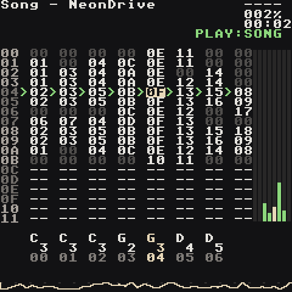
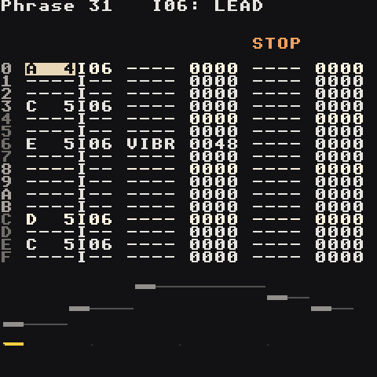
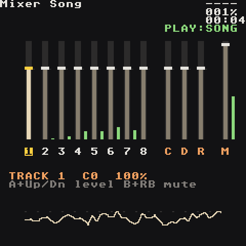

# Demo Songs

A handful of finished songs to open, play and pull apart: the walkthrough song you can build yourself, a funk / city pop feature tour, synthwave, a wuxia epic on real Chinese instruments, chiptune, house, and a stress test that runs every engine at once. Open them from the project list (they're in `Applications/Tracks` after [Install](Install)), press **Start** on the Song screen, then go poke around. Every idea in the other wiki pages is used somewhere in here.

## Afterglow — the walkthrough song

`lgpt_Afterglow` · C minor · 128 BPM with swing · 1:23

The melodic house track [Your First Song](Your-First-Song) builds press by press, finished. It starts from the synth kit every new song has and ends up using nearly everything the app does.

| Track | Part |
| --- | --- |
| 1 | Macro Synth kick, four on the floor; it drops out for the last bar of each build |
| 2 | Macro Synth snare with a reverb send; a `ROLL` + `VOLM` roll into each drop |
| 3 | Macro Synth hats, 16ths made with the fill tool, every 4th one `CHNC 0080` |
| 4 | offbeat bass between the kicks (the starter kit's `bass`, `sustain 00` for short notes) |
| 5 | HyperSynth `hyper pad`, chord `maj9` with `scale on`, `sub 00` and lows cut with its EQ, ducked by the kick (MOD `trig`) |
| 6 | FM4 `epiano` stabs on the offbeats with the bass, `CHRD 007E` |
| 7 | HyperSynth `trance lead`: the hook |
| 8 | a reversed crash from the `drums-909` pack, and one bar of the pad rendered to a sample and reversed |

**Look at:**
- **One bar, four chords** — the bass, pad and keys chains play the same phrase four times with transposes `00 FC 03 FE`: Cm9, Abmaj9, Ebmaj9, Bb9.
- **Song rows 00–0A** — intro, groove, build, drop, drop, break, build, drop, drop, outro, outro. Every section is the drop with parts taken out: chain `07` is the rest (a `KILL`), on every cell where a part drops out.
- **The low end** — the kick plays on the beat, the bass only between the kicks with short notes, and nothing else has any bass in it: that's why the drop is punchy instead of muddy.
- **The Groove** — `07 05` swings the 16ths.
- **Mix** — Mixer (kick up, bass down), FX reverb size, master EQ, limiter, and Project `Drive: 70` for headroom.

## Joyride — funk / city pop, the feature tour

`lgpt_Joyride` · C major (the last choruses in D) · 112 BPM with swing · 2:17

A fun one with a video-game soundtrack feel, and a tour of the whole app: the new drum and physical-modelling engines, FM, the HyperSynth, a wavetable chip lead, two samples from the packs, commands and a table, the effects and the mix. Every part is one small idea you can copy into your own songs.

| Track | Part | What it shows |
| --- | --- | --- |
| 1 | kick, and the tom fills | `drum` engine: `808 kick` (decay shortened so it's deep but tight), `808 tom` walking down at the end of each chorus |
| 2 | snare | `drum` engine `909 snare`: ghost notes are quiet `VOLM`s between the backbeats; a `VOLM 0030` + `ROLL 0092` roll swells into every chorus; reverb send |
| 3 | hats | `808 hat` 16ths with accents; the in-between ghosts have `CHNC 00B0`, so they play most of the time; an `808 open` hat on step `E` with `NTH 0044` (the 4th pass only), cut short by the next closed hat |
| 4 | bass | FM4 `slap bass`: a funk line with octave pops, ghost notes and `KILL`s, **one bar** that the chains transpose into every chord |
| 5 | pad | HyperSynth `strings`, chord `maj7` with `scale on`: one note a bar becomes the whole diatonic chord. Its own EQ cuts the lows. In the break a **table** gates it (`TABL 0000` + `TICK 0006`) |
| 6 | keys | FM4 `epiano` comping, `CHRD` voicings that move smoothly from chord to chord |
| 7 | lead | wav `chip lead` (pulse wave, vibrato, glide, dotted-8th echo): the hook, with `LEGA` slides, a `PTCH` bend and `VIBR` on the long notes; in the break a phys `vibes` plays it slowly; in the build an `ARPG` climbs |
| 8 | colour | phys `kalimba` arpeggios through the echo, a **trumpet sample** (`brass` pack) for the horn stabs (a `CHRD` triad on each hit), a **riser sample** (`textures` pack) into every chorus |

**What to listen for:**
- **Two chord progressions from one bar each.** The verse is I–vi–ii–V (Cmaj7, Am7, Dm7, G7), the chorus the "royal road" IV–V–iii–vi (Fmaj7, G7, Em7, Am7) that city pop and anime songs love. The bass and pad chains play one phrase four times with transposes: `00 09 02 07` and `05 07 04 09`.
- **The key change.** The last two choruses go up a whole tone: those chains transpose everything by 2 more, and a `SCAL 0215` on the pad moves the song's key to D so the HyperSynth's `scale on` chords follow. The intro's `SCAL 0015` puts it back in C.
- **The song gets bigger and smaller.** Intro (kalimba, pad, a tom run), groove, verse (the lead softer, `VOLM` on every note), pre-chorus (riser + snare roll), chorus (pad, horns, the hook on top), break (drums out, gated pad, vibes), build, two choruses in D, outro. Compare the loudness of each row.
- **The mix.** Mixer: keys down (`A8`), track 8 up (`E0`). Sends: reverb on the snare, pad and kalimba, the echo (`delay steps 3`, dotted 8ths) on the lead and kalimba, chorus on the pad. Master EQ adds a little weight and sparkle, the limiter catches the peaks, Project `Drive: 62` leaves headroom for eight tracks.
- **Swing** — groove `07 05`.

## Neon Drive — synthwave

`lgpt_NeonDrive` · A minor · 100 BPM · 1:55

A night drive: an 80s drum machine with a huge snare, a pumping octave bass, a glassy arpeggio and a singing lead.

| Track | Part |
| --- | --- |
| 1 | DRUM engine `909 kick` (half-time verses, four on the floor in the choruses) |
| 2 | DRUM engine `909 snare` with a big reverb send, a fill every 4 bars |
| 3 | DRUM engine `808 hat`, 8ths in the verses; accented 16ths and `808 open` offbeats in the choruses |
| 4 | octave-jumping 8th-note bass, **ducked by the kick** (MOD `trig`, `source 1`) |
| 5 | pad chords, one note + `CHRD` per bar, voiced around A3 with its lows cut (EQ) |
| 6 | pluck arpeggio above the pad (every other 16th in the verses) |
| 7 | lead melody, an octave up for the choruses (a bell takes it in the break and doubles it in the last chorus) |
| 8 | crash, tom fills and the bell |

**Look at:**
- **Song rows 00–0B** — each row is a section: intro, verse, chorus, break, build, chorus, outro.
- **The sidechain pump** — instrument `03`'s MOD page: a `trig` slot on `volume`, `amount -90`, fired by track 1. The bass plays on the kicks but dips out of their way, so the low end stays clear.
- **Track 6 in the intro** — only the first note has an instrument number, so the `FCUT 60C0` filter sweep keeps opening across four bars.
- **Track 5** — chords are voiced as inversions (one note + `CHRD`), so they move smoothly instead of jumping.
- **The lead** — `LEGA` slides into the verse notes, `VIBR` makes the long ones sing.
- **The build** — a snare crescendo with `VOLM`, then `RTRG 0003` for a 32nd-note roll into the drop.
- **The mixer, master EQ and limiter are untouched**: the whole balance is instrument volumes and sends.

## Jade Sword — wuxia / donghua

`lgpt_JadeSword` · A minor pentatonic · 92 BPM · 2:05

Neon Drive's song map re-scored for a martial-arts epic, played on **recordings of real Chinese instruments**. Compare the two projects screen by screen.

| Track | Part |
| --- | --- |
| 1 | dagu (big drum) with rim hits |
| 2 | Beijing-opera percussion: bangu clapper drum, small gong, cymbals |
| 3 | temple block in the verses, pipa plucks in the second chorus |
| 4 | sub bass on the chord roots (synth), kept under the drum |
| 5 | soft string pad (synth), lows cut with its EQ |
| 6 | guzheng — flowing broken chords from the chord root up, and glissandos |
| 7 | erhu — the chorus melody |
| 8 | dizi flute in the verses and a high counter-melody in the last chorus; the opera gong and a PHYS `temple bell` in the intro, break and ending |

**Look at:**
- **Every melody uses only A C D E G** — the pentatonic scale is what makes it sound Chinese.
- **Sample instruments** — open any of them: each plays one recording, repitched from its `root` note. Erhu and dizi have two recordings each (low and high) so no note is stretched too far.
- **The temple bell is not a recording** — instrument `0F` is the PHYS engine's struck model with `material` near metal: turn `material` down and it becomes wood, glass or a drum skin.
- **Grace notes** — a quick step into a melody note (`D4 E4` at the start of a bar) is how erhu and dizi players ornament.
- **Soft second plucks** — in the break the guzheng plucks its long notes again with `VOLM 50`, like a player letting the string ring. (Fast `RTRG` on a recorded instrument stutters, so it's saved for drums.)
- **Glissando** — a fast pentatonic run with rising `VOLM` before the chorus.
- **Opera percussion on one track** — each step picks its own instrument (clapper, small gong, cymbals).

The recordings are CC0 and CC BY 4.0 from Freesound; `CREDITS.md` in the song folder lists every author.

## Pixel Quest — chiptune

`lgpt_PixelQuest` · C major · 140 BPM · 1:15

An 8-bit adventure theme: title screen, verse, chorus, a minor-key bridge, a key change and a "stage clear" jingle. Every sound is the WAV engine.

| Track | Part |
| --- | --- |
| 1 | WAV `zap`: a sine with a pitch drop, the chip kick |
| 2 | WAV noise snare, a `VOLM` crescendo and `RTRG` stutter in the build |
| 3 | WAV `noise hat`, ghost 16ths with `CHNC` in the choruses |
| 4 | WAV `chip bass` (triangle): the root on the downbeat, octave jumps between the kicks |
| 5 | WAV `chip lead` (25% pulse), `VIBR` on long notes |
| 6 | the arpeggio, played by **tables** |
| 7 | the lead again, a 16th late (`DLAY 0003`) on a 50% pulse, panned right |
| 8 | WAV `lofi bell`: the bridge melody |

**Look at:**
- **Tables `00` and `01`** — a custom arpeggio: `PTCH` 0, +4, +7, +12, +7, +4, then `HOP` back, one row every 3 ticks (`TICK 0003` in the table). Table `01` is the minor one (+3). Each arp bar holds one note and starts a table with `TABL`.
- **`ARPG 0047`** — the title fanfare and the ending use the classic one-note chord on the lead instead.
- **The key change** — `TRSP 0002` in row 08 lifts the last choruses a whole tone; the very first step of the song has `TRSP 0000`, so every play starts in C again.
- **Mix** — Mixer levels (tune on top, arp behind), master EQ and a light limiter.

## Engine Room — the stress test

`lgpt_EngineRoom` · A minor · 100 BPM · 0:58 loop

Every heavy sound at once, on all 8 tracks the whole time: Macro Synth drums, FM4 bass, a HyperSynth pad (a six-note chord of detuned saws), FM4 e-piano chords (`CHRD` makes four FM voices per note), a HyperSynth lead and sampled piano, with chorus, echo, reverb, the master EQ and the limiter all working. If this plays cleanly, anything you write will. The device log's `[HEARTBEAT]` lines show the audio engine's `load peak` while it plays.

It's mixed like a real track even so: two sections (Am F C G, then F G Em Am with the lead an octave up) with turnaround fills, the bass between the kicks, and the pad and piano with their lows cut so the low end stays with the kick and bass.

## Sunset Club — disco house

`lgpt_SunsetClub` · A minor · 124 BPM with swing · 1:48

Played entirely on the [sample packs](Samples#sample-packs): 909 drums, congas and a shaker, piano and string chords, a finger bass and a trumpet.

| Track | Part |
| --- | --- |
| 1 | 909 kick, four on the floor |
| 2 | 909 clap on 2 and 4, a `ROLL` into the drop |
| 3 | 909 hats, swung 16ths |
| 4 | open hat on the offbeats, shaker, congas; the riser and crash |
| 5 | finger bass on the offbeats, its EQ lifting the lows |
| 6 | house piano stabs (min7 / maj7 one-shots) |
| 7 | string chords, ducked by the kick |
| 8 | the trumpet hook, call and response |

**Look at:**
- **Four on the floor** — the kick on every beat (steps `0 4 8 C`), the clap on 2 and 4, the open hat on every offbeat (`2 6 A E`).
- **Swing** — Groove `00` is `07 05`: every second 16th lands late, which makes the hats and congas bounce.
- **House piano** — one-shot min7/maj7 chords chopped into syncopated stabs, each cut short with `KILL`.
- **The bass between the kicks** — it plays the offbeats, so bass and kick never fight. Its EQ page boosts the lows the recording is thin on.
- **Sidechain on a sample** — the string chords have a MOD `trig` slot fired by track 1: they dip on every kick, the house pump.
- **Room for everyone** — the piano and strings cut their lows with the instrument EQ.
- **Song rows 00–0D** — intro, groove, bass, piano, horn, breakdown, build, drop ×3, a DJ break with just kick, bass and congas, outro.

## Make them yours

- Change the tempo on the Project screen.
- Swap a preset: go to any instrument, **A + Left/Right** on `preset`.
- Mute tracks with **B + RB** to hear how each part is built.
- **Save Song As** to keep your version and leave the original untouched.

The songs are generated from Python in `tools/demos/` with the [song composer](Developer-Guide#song-composer), so they double as code examples of every technique.
