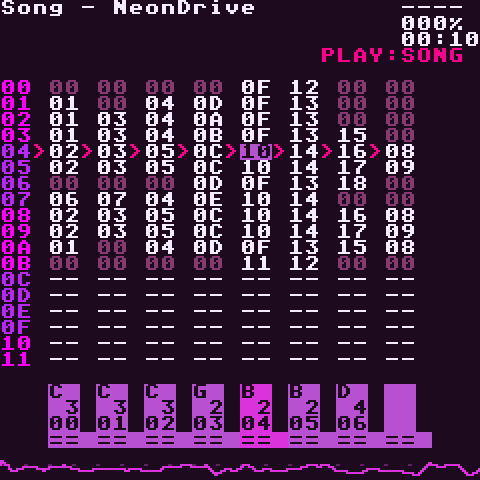
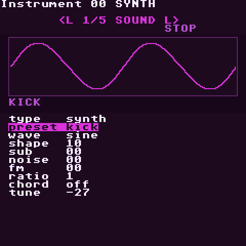
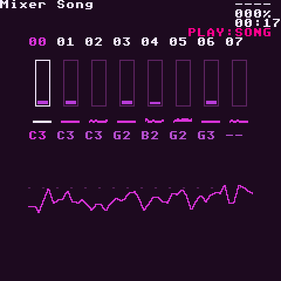

  
  
  

<h1 align="center">LGPT for RG Nano</h1>

<b>A pocket tracker workstation for the Anbernic RG Nano.</b> 
Eight tracks, built-in synths, reverb and echo, sampling, WAV export — on a 1.54" screen.

---

This is a fork of [LittleGPTracker / Little Piggy Tracker](https://github.com/djdiskmachine/LittleGPTracker) rebuilt for the RG Nano's 240×240 screen and tiny buttons, with the spirit of the Dirtywave M8: everything you need to write a full song lives in your pocket, and the screen stays quiet so the music does the talking.

**Never used a tracker?** Go straight to **[Your First Song](Your-First-Song)**. It takes about ten minutes and you will have a beat, a bassline and chords at the end.

## Start here

| | Page | What you get |
| --- | --- | --- |
| 1 | **[Install](Install)** | Put the app and demo songs on your RG Nano |
| 2 | **[Controls](Controls)** | Every button combo on one page |
| 3 | **[How Trackers Work](How-Trackers-Work)** | The four ideas behind every tracker |
| 4 | **[Your First Song](Your-First-Song)** | Beat → bass → chords → arrangement, step by step |
| 5 | **[Demo Songs](Demo-Songs)** | Four finished songs to open, play and pull apart |

## Reference

| Page | |
| --- | --- |
| **[Screens](Screens)** | Song, Chain, Phrase, Instrument, Table, Groove, Project, Mixer, Helper |
| **[Synth](Synth)** | The built-in synth: every knob, every preset, sound recipes |
| **[Commands](Commands)** | All phrase/table commands with examples |
| **[Music Theory Cheat Sheet](Music-Theory-Cheat-Sheet)** | Scales, chords, progressions and drum patterns that just work |
| **[Samples](Samples)** | Using your own WAV files |
| **[Export](Export)** | Bounce your song to WAV (stereo or stems) |
| **[FAQ](FAQ)** | Common "why did that happen?" answers |
| **[Developer Guide](Developer-Guide)** | Simulator, tests, song composer, build and install scripts |

## What makes this fork different

- **Makes sound instantly.** New projects come with a 16-instrument synth kit: kick, snare, hats, clap, bass, lead, pad, pluck, keys, bell, acid, sub, chip, tom, perc.
- **M8-style synth engine.** Seven waveforms, sub oscillator, noise, 2-operator FM, one-note chords, envelopes, resonant filter, drive, LFO, glide — plus shared reverb and tempo-synced echo.
- **Designed for 240×240.** Each instrument page draws what its knobs do. Explanations only appear when you ask for them with **RB + Select**.
- **Tested like a product.** A desktop simulator drives the real app with scripted button presses, checks the screens and measures the audio before anything goes on the device.

> **Tip:** On any screen, **RB + Select** opens the helper: a map of where you are, the buttons for this screen, and a short how-to. Press it again to close.
