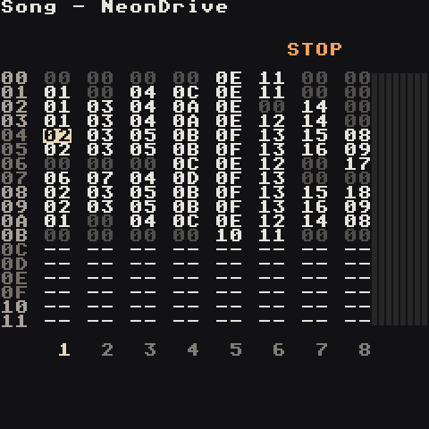
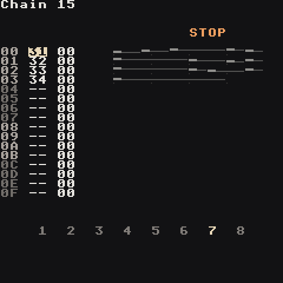
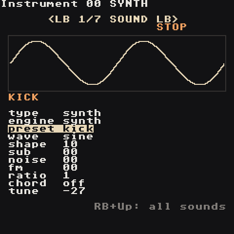

# How Trackers Work

A tracker is a spreadsheet that plays music. Time runs **down** the screen one row at a time; instead of drawing notes, you type them into rows. Everything else is just organising those rows.

## Four layers

```text
SONG        the arrangement
 └─ CHAIN   a track's bars
   └─ PHRASE one bar
     └─ INSTRUMENT the sound
```

The song is 8 tracks side by side, rows are time. A chain lists one track's bars in order. A phrase is one bar: 16 steps of notes and commands. The instrument is the sound each note uses.

| Layer | Screen | Think of it as |
| --- | --- | --- |
| **Song** |  | The timeline. Each cell names a chain. Everything on the same row plays **at the same time**, one chain per track. |
| **Chain** |  | A section of one track, e.g. "4 bars of drums". Each row is one phrase; the second column transposes it. |
| **Phrase** |  | One bar. 16 rows = 16 steps = 16th notes. Columns: note, instrument, two commands. |
| **Instrument** |  | The sound: a built-in synth or a WAV sample. |

Here is how they point at each other. A song row names a chain for each track:

```song
00 00 01 -- -- -- -- -- --
01 00 02 -- -- -- -- -- --
```

Chain `00` lists the phrases track 1 plays, one per row; the second column transposes that phrase:

```chain
00 00 00
01 00 00
02 00 00
03 01 00
```

And phrase `00` is the kick itself: instrument `00` on every beat, rows `00 04 08 0C`, with a quieter kick just before the bar ends. The clap would be another phrase, on track 2:

```phrase
00 C 3 00 ----
01 --- -- ----
02 --- -- ----
03 --- -- ----
04 C 3 00 ----
05 --- -- ----
06 --- -- ----
07 --- -- ----
08 C 3 00 ----
09 --- -- ----
0A --- -- ----
0B --- -- ----
0C C 3 00 ----
0D --- -- ----
0E C 3 00 VOLM 0060
0F --- -- ----
```

Two helpers sit to the side:

- **Table** — a small list of commands that runs on its own, one row per tick: automation, arpeggios, stutters.
- **Groove** — how long each step lasts. `6 6` is straight time; `7 5` swings.

## Why it's built this way

Reuse. A drum bar you wrote once can appear in 40 places: every chain that lists that phrase plays it, and every song row that lists that chain plays it. Change the phrase once and every copy changes. Songs stay tiny and edits stay fast — that's how people write full albums on a Game Boy.

## Variations: same or new

Because a row only points at a phrase, there are two kinds of copy:

- **Y** pastes the same one. Both rows play phrase `03`; change it and both change. Right for a drum bar that repeats.
- **LB + Y** makes a new one. You get phrase `07` with the same notes as `03`; change `07` and `03` stays as it was. Right for "the same bar, but the last hit is different".

The quickest variation: on the Chain, put the cursor on phrase `03` and press **Y** with nothing copied. A new copy lands in the next empty row, ready to change. The Song does the same with whole chains. The full table is in [Controls](Controls#copy-and-paste).

## Numbers are hex

Values count `00 01 02 … 09 0A 0B 0C 0D 0E 0F 10 … FF`.

| Hex | Means about |
| --- | --- |
| `00` | nothing / off |
| `40` | a quarter |
| `80` | half |
| `C0` | three quarters |
| `FF` | full |

You never need to convert. Nudge the value and listen.

## Notes

`C 3`, `D#3`, `A 2` — letter = note, number = octave. `A 3` is 440 Hz. Drums sound right at `C 3`; bass instruments are pre-tuned lower so `C 3` already sounds deep.

## Time

- 1 step = a 16th note
- 4 steps = one beat
- 16 steps = one bar = one phrase
- The tempo (BPM) is on the Project screen.

Steps are made of **ticks** (6 per step with the default groove). Commands like `RTRG` and `KILL` count in ticks.

## Tracks are monophonic

Each track plays one note at a time; a new note replaces the old one. That's why you use separate tracks for kick, snare and bass. For chords, the synth plays several notes from one with the `chord` knob or the `CHRD` command — see [Synth](Synth).

## Silence and looping

- A note keeps sounding until the next note on that track, or until a `KILL` command.
- In the Song, an empty `--` cell makes that track jump back to the top of its block and loop. To make a track rest for a section, give it a chain of empty phrases.
- Keep every chain on a Song row the same length so the tracks stay in step.

Next: **[Your First Song](Your-First-Song)**.
