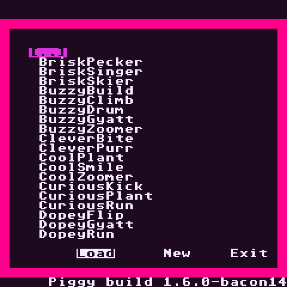
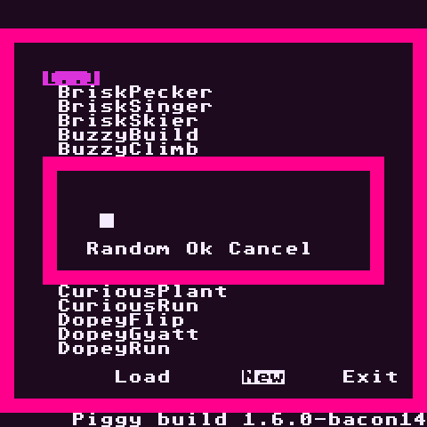

# Install

## What you need

- An Anbernic RG Nano (FunKey-OS)
- A way to copy files to its SD card: USB cable (the Nano shows up as a drive) or an SD card reader
- The build zip `lgpt-rgnano-test-build.zip` (from the repository's GitHub Actions artifacts, or built yourself — see [Developer Guide](Developer-Guide))

## Copy the files

The zip contains:

```text
lgpt-rgnano/
├── lgpt-rgnano.opk          the app
├── Tracks/                  demo songs
│   ├── lgpt_NeonDrive
│   ├── lgpt_JadeSword
│   ├── lgpt_RainyWindow
│   └── lgpt_PixelQuest
├── TRACKER_BASICS.md
├── RGNANO_USER_MANUAL.md
└── RGNANO_INPUT_MAP.md
```

Put them on the SD card like this:

| From the zip | To the SD card |
| --- | --- |
| `lgpt-rgnano.opk` | `Native games/lgpt-rgnano.opk` |
| `Tracks/lgpt_*` folders | `Applications/Tracks/` |
| your own `.wav` files (optional) | `Applications/Samples/` |

Create `Applications/Tracks` and `Applications/Samples` if they don't exist.

On the device these are `/mnt/Applications/Tracks` and `/mnt/Applications/Samples`.

## Launch

Open **Native games → LGPT RG Nano**. The project list appears:



- **Load** a demo song: highlight `lgpt_NeonDrive` and press **A** on `Load`.
- **New** starts an empty project (with the synth kit ready to play).



Choose `Random` for a name, then `Ok`.

## Updating

Replace `Native games/lgpt-rgnano.opk` with the new one. Your songs in `Applications/Tracks` are not touched.

From a PC with this repository, `tools/install-rgnano.ps1` builds, packages and installs everything onto a connected RG Nano in one step.

## Where things are saved

| What | Where |
| --- | --- |
| Songs | `Applications/Tracks/lgpt_<name>/lgptsav.dat` (Project screen → `Save Song`) |
| Samples used by a song | `Applications/Tracks/lgpt_<name>/samples/` |
| Exported audio | inside the song folder: `mixdown.wav` or `channel0.wav`…`channel7.wav` |
| Diagnostic log | `Applications/lgpt-rgnano.log` |
