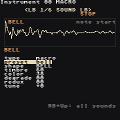
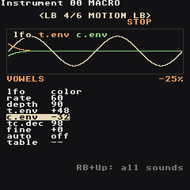

# Macro Synth

The **macro synth** is a third kind of instrument, next to the synth and the sampler — the same idea as the M8's MacroSynth. Instead of building a sound from waves, you pick a **shape**: a complete synthesis model (analog waves, FM, vowels, plucked strings, bells, 808-style drums, wavetables, noise…) and play it with just two knobs, **timbre** and **color**. Every shape uses them differently, so 47 shapes × 2 knobs is a huge palette with very little to learn.

**Make one:** open an instrument (**RB + Right** from a phrase), put the cursor on `type` and press **A + Right** until it says `macro`. The cursor sits on `preset`: **A + Left/Right** flips through ready sounds, **A + Start** plays one (**Start** plays the phrase, as everywhere).

The engine is a port of Emilie Gillet's open-source macro oscillator from the Braids module (MIT licence). It runs at its native 96 kHz and is resampled for the mixer, so tuning, vowels and drum decays sound exactly as designed.

 

## Presets

| Preset | Shape | Sound |
| --- | --- | --- |
| `init` | CSAW | a plain start for your own sound |
| `pluck` | PLUCK | plucked string (guitar, koto, harp) |
| `bell` | BELL | struck bell, long ring |
| `vowels` | VOWEL | a voice singing a-e-i-o-u, the LFO moves the vowel |
| `choir` | VFOF | soft "aah" pad with vibrato |
| `flute` | FLUTE | breathy flute |
| `strings` | BOWED | bowed string (erhu, violin) |
| `organ` | HARM | drawbar-style organ |
| `chords` | WTx4 | a four-note chord from every note |
| `synclead` | SAW SYNC | classic sync lead with a bite on every note |
| `foldlead` | FOLD | wavefolded lead |
| `bass` | SAW SUB | saw with a sub, filter bite |
| `fmbass` | FM | punchy FM bass |
| `reese` | SWARM | seven detuned saws, dark |
| `acid` | ZLPF | squelchy line with glide |
| `kick` | KICK | 808-style kick |
| `snare` | SNARE | 808-style snare |
| `hat` | CYMBAL | metallic hat |
| `metaltom` | DRUM | metallic tom |
| `toy` | TOY | circuit-bent toy keyboard |
| `wavescan` | WMAP | a wavetable that keeps moving |
| `cloud` | CLOUD | grainy texture pad |
| `wind` | TWINQ | resonant wind |

Drums are tuned so `C 3` sounds right; basses sound two octaves down.

## Pages

Seven pages, switched with **LB + Left/Right**. SOUND and MOTION are the macro synth's own; ENV, FILTER, MOD, MIX and EQ are exactly the [Synth](Synth) pages. **RB + Select** explains the knob under the cursor — on `shape` it tells you what timbre and color do on that shape.

### SOUND - shape and knobs

| Knob | Does |
| --- | --- |
| `type` | sample / synth / macro |
| `preset` | load a ready sound (overwrites the knobs) |
| `shape` | the synthesis model, 47 of them (list below). **A + Up/Down** jumps 8 at a time |
| `timbre` | the shape's first knob |
| `color` | the shape's second knob |
| `degrade` | sample-rate reduction: `00` off … `FF` = 4 kHz. Aliasing, lo-fi |
| `redux` | bit reduction: `00` off (16 bit) … `FF` = 2 bits. Grit, crunch |
| `tune` | semitones, `-12` = an octave down |

The picture is the shape's real output with the current knobs, at `C 3`: two cycles of a steady tone, the first 120 ms of a struck shape (`note start`), or 20 ms of a noise (`20 ms`). Degrade and redux show up as steps.

### MOTION - movement

| Knob | Does |
| --- | --- |
| `lfo` | what the LFO moves: `pitch`, `cutoff`, `volume`, `timbre`, `color` |
| `rate` | `00` = 0.05 Hz … `80` = 1.6 Hz … `FF` = 50 Hz |
| `depth` | how much; `00` = off |
| `t.env` | jump of timbre at every note, `-127` … `+127`; it falls back to the knob |
| `c.env` | the same for color |
| `tc.dec` | how fast `t.env` and `c.env` fall back (`80` = 100 ms) |
| `fine` | fine tune in cents |
| `auto` / `table` | an instrument table that runs on every note |

`t.env` is how a macro sound gets a "pluck": `FM` with `t.env +40` starts bright and mellows, `ZLPF` with `t.env +60` is an acid squelch.

 

### The other pages

- **ENV** — attack, decay, sustain, release, pitch drop, glide, as on the synth. Struck shapes (PLUCK, BELL, DRUM, KICK, SNARE) fade on their own: keep `sustn` at `FF` and let the shape decide.
- **FILTER** — lowpass / highpass / bandpass / off after the shape (off in `init`), with its own envelope and drive.
- **MOD** — the four modulation slots (envelopes, LFOs, key tracking). On a macro synth they can also move `timbre` and `color` — an LFO on timbre is the classic way to make a shape evolve.
- **EQ** — the instrument's own low / mid / high EQ.
- **MIX** — volume, pan and the reverb / delay / chorus sends.

## Shapes

What `timbre` and `color` do on each shape:

| Shape | Timbre | Color |
| --- | --- | --- |
| `CSAW` | notch width | notch depth, phasing |
| `MORPH` | triangle → saw → square → pulse | darker → fuzzier |
| `SAW/SQR` | phase / pulse width | saw to square |
| `FOLD` | wavefolder | sine to triangle |
| `BUZZ` | sine to buzzy comb | detune of two buzzes |
| `SQR SUB` / `SAW SUB` | width | sub one or two octaves down |
| `SQR SYNC` / `SAW SYNC` | pitch of the synced oscillator | mix |
| `SAW x3` `SQR x3` `TRI x3` `SIN x3` | interval of the 2nd oscillator | interval of the 3rd (snaps to octaves, fifths) |
| `RING` | 2nd sine ratio (ring modulated) | 3rd sine ratio |
| `SWARM` | detune of 7 saws | highpass |
| `COMB` | comb pitch | feedback (`80` = none) |
| `TOY` | clock rate | glitches |
| `ZLPF` `ZPKF` `ZBPF` `ZHPF` | filter cutoff | saw → square → triangle |
| `VOSIM` | formant 1 | formant 2 |
| `VOWEL` / `VFOF` | the vowel: a, e, i, o, u | formant shift (bigger / smaller voice) |
| `HARM` | centre harmonic | spread |
| `FM` / `FBFM` / `CHAOFM` | FM amount | ratio (feedback / chaotic flavours) |
| `PLUCK` | damping | pluck position |
| `BOWED` | bow friction | bow position |
| `BLOWN` / `FLUTE` | air pressure | instrument geometry |
| `BELL` | damping | inharmonicity |
| `DRUM` | damping | brightness |
| `KICK` | decay | tone |
| `CYMBAL` | band cutoff | squares vs noise |
| `SNARE` | tone balance | snappy noise |
| `WTBL` | sweep the table | which of 20 tables |
| `WMAP` | across the 16×16 map | down the map |
| `WLINE` | scan every wave | smoothing |
| `WTx4` | morph the waves | chord of the 4 voices |
| `NOISE` | resonance | lowpass → highpass |
| `TWINQ` | resonance of two peaks | their spacing |
| `CLKN` | loop length | number of steps |
| `CLOUD` / `PARTCL` | grain density | pitch scatter |
| `QPSK` | bit rate | data byte |

## Commands

Everything the [Synth](Synth) understands — `VOLM` `PAN_` `FCUT` `FRES` `FLTR` `PTCH` `LEGA` `PFIN` `ARPG` `RTRG` `CRSH` (drive) `KILL` `TABL` `DLAY` — plus two of its own:

| Command | Value | Does |
| --- | --- | --- |
| `TIMB` | `aabb` | timbre to `bb` at speed `aa` (`00` = now) |
| `COLR` | `aabb` | color to `bb` at speed `aa` |

`RTRG` restrikes the shape too (drum rolls). `CHRD` is ignored: every chord note would need a whole shape — use `WTx4` for chords, or several tracks.

**Try:** `vowels` on a held note with `TIMB 2000` then `TIMB 20FF` — the voice slides from "a" to "u". A table with `COLR 0000`, `COLR 0080`, `COLR 00FF` steps through the `WTBL` tables.

## CPU

The shape runs at 96 kHz and is resampled, yet a macro voice costs no more than a synth voice: in the ARM check (`tools/dsp-harness/macro_check.cpp`, device build under qemu) eight macro voices take 0.6× to 0.9× the time of eight synth `pad` voices, the heaviest shape being `HARM`. Eight voices of any shape fit on the RG Nano.
