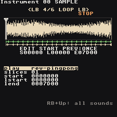
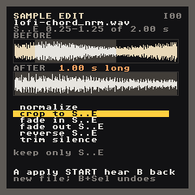

# Samples

Any instrument slot can play a WAV file instead of a synth. The RG Nano has no microphone, so the practical route is to make or record sounds elsewhere (a phone, a PO-33, a computer) and copy them over.

## Get WAVs onto the Nano

Copy `.wav` files (16-bit, mono or stereo, any sample rate) into `Applications/Samples` on the SD card. Folders are fine.

## Sample packs

The install puts a set of packs in `Applications/Samples`, one folder each. Melodic samples are recorded or rendered at a known pitch and the chords are rooted on `A 2`, so they play in tune straight away.

| Pack | What's in it |
| --- | --- |
| `keys` | grand piano (low, mid, high, soft), harp, glockenspiel, marimba |
| `strings` | violins (low, high) and cellos (low, mid), sustained; violin and cello pizzicato |
| `brass` | horn, trumpet, trombone |
| `bass` | upright (low, high), finger bass, Reese |
| `epiano` | a tine electric piano note plus maj, min, 7th and 9th chords |
| `chords` | one-shot piano, soft piano and string chords: maj, min, maj7, min7, dom7, maj9, min9 |
| `guitar` | clean, muted and power-chord guitar |
| `percussion` | timpani, orchestral snares, crash, cymbal, shaker, bongos, congas, triangle, claves |
| `drums-808` / `drums-909` | the classic drum machines: kick, snare, clap, hats, and more |
| `drums-dusty` | a lo-fi kit: soft kick, old snare, hat, rim |
| `drums-jazz` | brush tap and swish, ride and ride bell, soft kick |
| `textures` | vinyl crackle, tape hiss, a riser |
| `chinese` | guzheng, erhu, dizi, pipa, dagu and opera percussion |

The orchestral recordings come from the Versilian Studios Community Edition (CC0). The Chinese instruments are CC0 and CC BY 4.0 recordings from Freesound. The drums, guitar, bass, e-piano, chords and textures are synthesized for this project. Each folder's `CREDITS.md` has the details. The [genre demo songs](Demo-Songs#a-song-for-every-genre) use every pack.

## Turn a slot into a sampler

1. Open an instrument (**RB + Right** from a phrase).
2. On the first page, set `type` to **sample** (cursor on `type`, **A + Left**).
3. Move to `sample` and press **Select**: the sample browser opens.
4. Highlight a file. `Listen` previews it, `Import` copies it into the song and assigns it. **Start + Up/Down** browses while previewing, **Start + Right** imports.

Imported samples live inside the song folder (`lgpt_<name>/samples/`), so the song keeps working even if you tidy up `Applications/Samples`.

## Sample pages

**LB + Left/Right** switches between the seven sample pages:

| Page | What it edits |
| --- | --- |
| Source | sample, play mode, root note, detune, slices |
| Shape | volume, pan, reverb, delay and chorus sends (the shared effects on the [FX screen](Screens#fx)), crush, drive, downsample |
| Filter | cutoff, resonance, filter type and mode |
| Loop | play mode, slices, start, loop start, end |
| Mod | four slots (ADSR/AHD/drum envelopes, LFOs, key tracking) on volume, cutoff, reso, pitch, fine, pan, drive, crush, feedback, sample start, loop start or the sends — see [Synth → MOD](Synth#mod--4-modulation-slots) |
| Motion | instrument table, feedback |
| EQ | the instrument's own low / mid / high EQ, drawn as a curve — see [Instrument EQ](#instrument-eq) |

## Instrument EQ

The last page. Each sample instrument has its own three-band EQ, the same as a synth's ([Synth → EQ](Synth#eq--its-own-tone)): `l.gain`/`l.freq` a bass shelf (30–400 Hz), `m.gain`/`m.freq` a bell (150 Hz–6 kHz), `h.gain`/`h.freq` a treble shelf (1.5–16 kHz). Gains `80` = flat, −12 … +12 dB. It shapes only this sound, before its effect sends; flat bands cost nothing. The curve above the knobs shows the result, and the focused knob's value is shown in dB or Hz.

**Try:** thin a loop with `l.gain` `−8 dB` so the kick has the bottom to itself, or brighten a dull vocal chop with `h.gain` `+4 dB`.

## Play modes

`play` (on Source and Loop) picks the direction and whether the sample loops, the same choices as the M8's sampler. **S**, **L** and **E** are the start, loop start and end markers (see [Trimming](#trimming)).

| `play` | A note plays |
| --- | --- |
| `forward` | S to E, once (the default) |
| `reverse` | E back to S, once |
| `loop` | S to E, then L to E again and again |
| `rev-loop` | E back to L, again and again |
| `pingpong` | S to E, then back and forth between E and L |
| `rev-pingpong` | E back to L, then back and forth |
| `osc` | L..E is one wave cycle, pitched like a synth (single-cycle waveforms) |
| `osc-rev` / `osc-pingpong` | the cycle backwards / there and back |
| `loop-sync` | L..E stretched to one bar at the song tempo (drum loops that follow the tempo) |

Under the waveform a green line with arrows shows the first pass and which way it goes; a second line shows the part that loops (arrows both ways for ping-pong). With `slices`, every slice plays its own part in the chosen mode, so `reverse` plays each slice backwards.

A single note can use another mode with the `PLAY` command: `PLAY 0001` on a step with a note plays that note in reverse while the instrument stays `forward` (the number is the mode's place in the list above: `00` forward, `01` reverse, `02` loop, `03` rev-loop, `04` pingpong, `05` rev-pingpong, `06` osc, `07` osc-rev, `08` osc-pingpong, `09` loop-sync). On a step without a note it turns the sound that is already playing around from where it is.

Songs made before these modes open unchanged: `none` is now `forward`, `ping pong` is `pingpong`, `oscillator` is `osc`, `looper sync` is `loop-sync`.

 

## Trimming

Source and Loop show the waveform with three markers: **S** start, **L** loop start, **E** end.

| Input | Does |
| --- | --- |
| **LB + Up/Down** | pick the marker |
| **LB + A + Left/Right** | nudge it |
| **A + Start** | hear the sample from S to E (**RB + A + Left/Right**: an octave down/up) |
| **RB + Start** | switch that preview between once and loop (`PREV:` on screen), in the play mode's direction |
| **Select** | open the [sample editor](#sample-editing) (on `sample`: import; on `root`: find the root) |

## Sample editing

Like the M8's sample editor, with the same processes. On the Source or Loop page press **Select** (anywhere but on `sample` and `root`). The editor works on the part between **S** and **E**, shaded in the pictures: **BEFORE** is the sample now, **AFTER** what the edit will make.

| Edit | Does |
| --- | --- |
| `normalize` | makes S..E as loud as it can be without clipping |
| `crop to S..E` | keeps only S..E (L moves with the sound) |
| `fade in S..E` | S..E rises from silence |
| `fade out S..E` | S..E falls to silence |
| `reverse S..E` | S..E plays backwards |
| `trim silence` | cuts the quiet start and end of the whole sample |

| Input | Does |
| --- | --- |
| **Up / Down** | pick an edit |
| **A** | make it |
| **Start** | hear the sample (again: stop) |
| **B** | back to the instrument |

Nothing is overwritten: **A** writes a new file next to the original (`kick.wav` becomes `kick_nrm.wav`, `kick_crop.wav`, `kick_rev.wav` ...), puts it on the instrument and keeps your markers where they were in the sound. Edits chain: crop, then normalize the result. Changed your mind? Close the editor and press **B + Select**: the instrument goes back to the previous file (the new file stays in the song's `samples` folder, unused). To fade only the last bit of a sound, move **S** there first (**LB + Up/Down**, **LB + A + Left/Right**), fade out, then move S back.

If an edit would change nothing the editor says why instead (`already as loud as it gets`, `move S or E in first`, `no silence at the ends`).

 

## Root note

If a melodic sample plays out of tune, go to `root` and press **Select**: the app listens to the trimmed part and suggests a root note. **Select** again accepts it.

## Render to sample

Resampling, M8 style: on a Phrase press **LB + Start** to record that bar, or on a Chain to record the whole chain. It plays once, with every track, effect and fader as you hear it, and lands as `rs_01.wav` on the next free instrument. **A** opens the new instrument; **B** cancels and leaves nothing behind. Chop it with `slices`, play it backwards with `play reverse`, trim and normalize it in the [sample editor](#sample-editing), or stack it again.

## Slices

Set `slices` above `01` to chop the sample into equal parts; note `C-2` plays slice 0, the next semitone slice 1, and so on — handy for drum loops.
