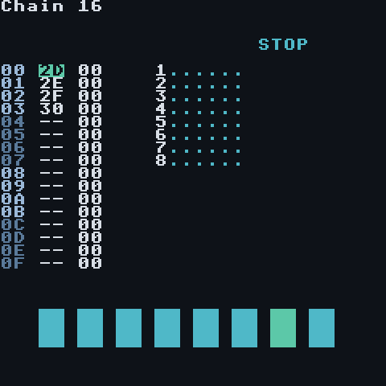
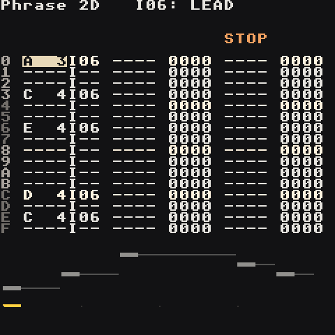
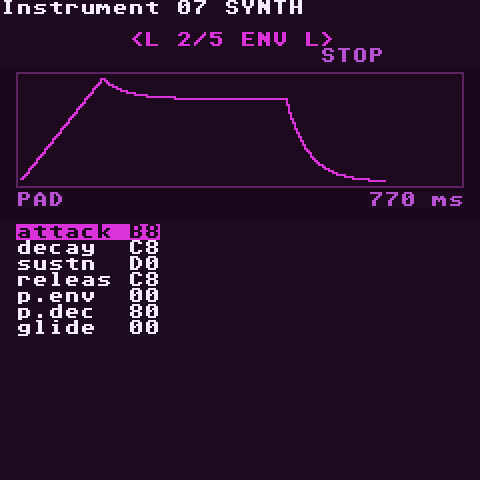
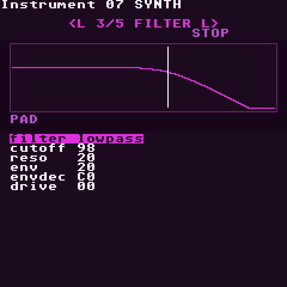
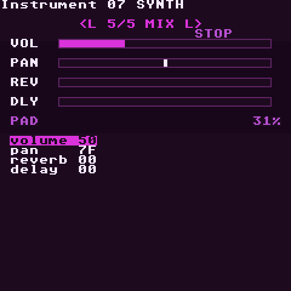
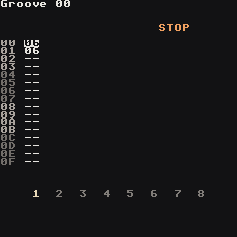
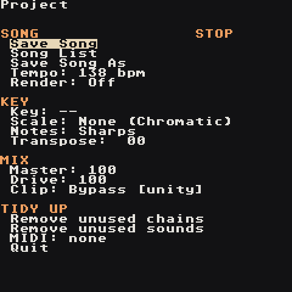
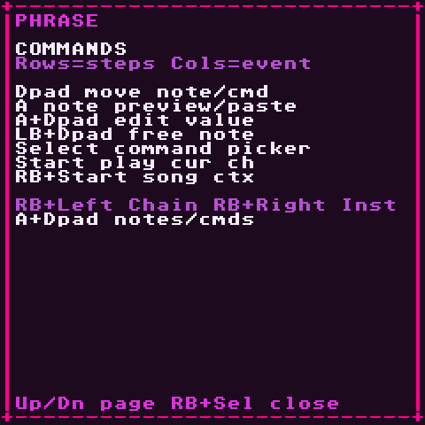
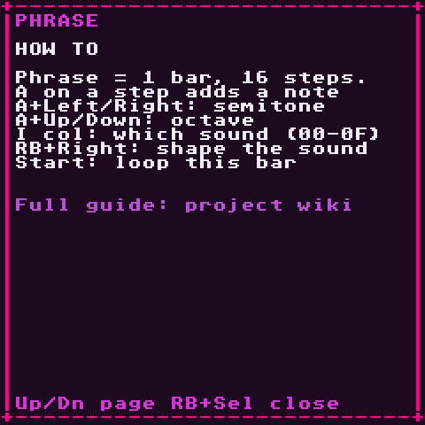

# Screens

Every screen at a glance. For the full button list see [Controls](Controls).

## Song

The arrangement. Columns are the 8 tracks, rows are time. Each cell holds a chain number, or `--` for nothing.

- Everything on one row starts together.
- Rows play top to bottom; each track loops back to the top of its block when it reaches `--`.
- While playing, the strip at the bottom shows each track's current note and instrument, with a small level meter.

 

## Chain

One track's playlist of bars. Left column: phrase number. Right column: transpose in semitones (`0C` = up an octave, `F4` = down an octave).

The meters on the right show which tracks are making sound.

 

## Phrase

One bar, 16 steps. Columns:

1. **Note** — `C 3`, `----` for none
2. **Instrument** — `I00`…`I7F`; the name of the instrument under the cursor shows in the title
3. **Command 1** + value
4. **Command 2** + value

Beat rows (`00 04 08 0C`) are highlighted so you can see the grid. The line at the very bottom is a live waveform of the output.

 

## Instrument (synth)

Five pages, switched with **LB + Left/Right**. The top half draws what the page does — waveform, envelope, filter curve, LFO, levels — and shows the preset name and the focused value in real units (`32 ms`, `641 Hz`). The knobs are listed below. Full details on the **[Synth](Synth)** page.

The first row, `type`, switches the slot between **synth** and **sample**.

## Instrument (sample)

Sample instruments have five pages too: Source, Shape, Filter, Loop, Motion, with a waveform and start/loop/end markers. See **[Samples](Samples)**.

## Table

Three command columns that step one row per tick and loop. Tables run on their own once triggered — by `TABL` in a phrase, or automatically by an instrument (MOD page, `table`). Use them for arpeggios, stutters, pitch wobbles and filter wiggles you don't want to write note by note.

 

## Groove

How many ticks each step lasts, cycling. `06 06` is straight. `07 05` swings (long-short). `08 04` shuffles hard. Groove `00` is used by default; the `GROV` command switches a track to another groove.

 

## Project

| Field | What |
| --- | --- |
| Tempo | BPM |
| Master / Drive | output level / level into the soft clipper |
| Clip | soft clipper strength (Bypass … Insane) |
| Transpose | shifts every note in the song |
| Key / Scale / Notes | note-editing helper and sharp/flat spelling |
| Reverb / Damp | size and darkness of the shared reverb |
| Echo / Fdbk | delay time in 16ths (`3` = dotted 8th) and repeats |
| Song List / Save Song / Save Song As | back to the song list (offers to save first), save, save a copy |
| Remove unused chains / sounds | tidy up chains, phrases and instruments nothing uses |
| Quit | leave the app (offers to save first) |
| Render | `Stereo` or `Stems`, then **Start** to export ([Export](Export)) |

 

## Mixer

Level meters for the 8 tracks and a live waveform of the master output. Use it to spot the track that's too loud or a mix that's clipping.

 

## Helper (RB + Select)

Available on every screen, including dialogs. **Down/Up** flips between:

1. **Map** — where you are and where RB + direction goes
2. **Commands** — the buttons for this screen. On the synth pages it also explains the knob under the cursor.
3. **How to** — a short walkthrough for this screen

On any page, **A** opens the built-in guide at the section for the current screen.

While the helper is open, other buttons are ignored, so you can't change anything by accident.
