# Screens

Every screen at a glance. For the full button list see [Controls](Controls).

## Song

The arrangement. Columns are the 8 tracks, rows are time. Each cell holds a chain number, or `--` for nothing.

- Everything on one row starts together.
- Rows play top to bottom; each track loops back to the top of its block when it reaches `--`.
- While playing, the strip at the bottom shows each track's current note and instrument.
- The eight thin bars to the right of the grid are level meters, one per track: the track you're on is highlighted, muted tracks go dim, and a bar gets an amber cap when it's close to full.

 

### Bookmarks and sections

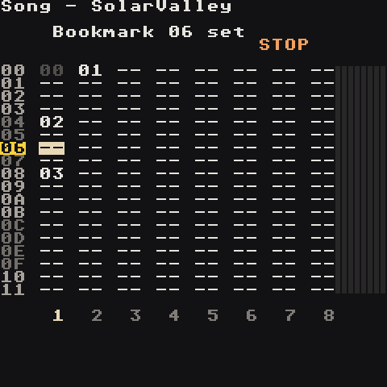

**A + Select** bookmarks the row the cursor is on (again: removes it). A bookmarked row's number turns into an amber tag. **LB + Up/Down** jumps to the next or previous place a part starts: a bookmark, or the first chain of a block on the track you're on (a chain right under an empty cell). The screen says which it found (`Bookmark 20`, `Section 10`). Bookmarks are saved with the song, and **B + Select** undoes them like any edit.

 

### Moving tracks

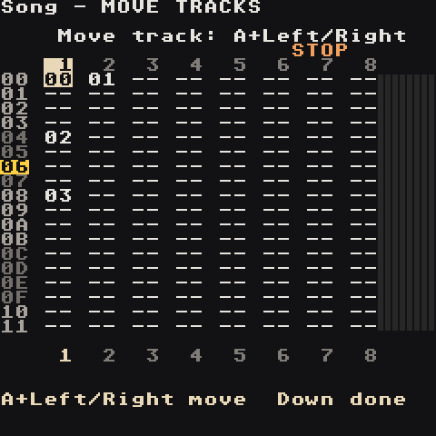

On row `00`, press **Up** once more: the title says `MOVE TRACKS` and the track numbers appear above the grid. **Left/Right** picks a track, **A + Left/Right** carries it past its neighbour, with its chains on every row, its mixer fader and its mute. **Down** (or **B**) goes back to the grid. Stop the song first; the screen tells you if it's playing.

 

### Live mode

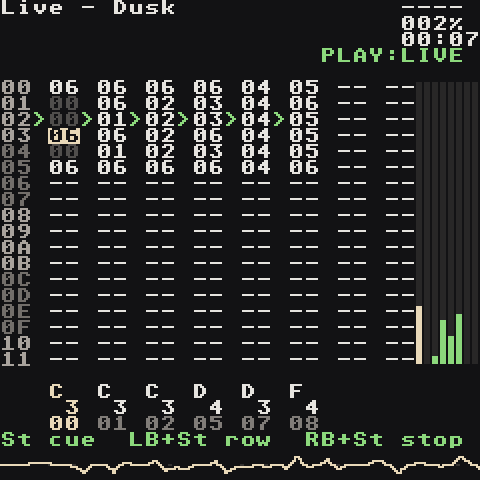

**Select** turns the Song screen into a clip launcher. **Start** on a cell cues that chain on its track (it blinks green until it starts, then loops), **LB + Start** cues the whole row, **RB + Start** cues a track to stop, **B + Start** stops everything. The buttons are listed at the bottom of the screen. Full table: [Controls → Live mode](Controls#live-mode).

 

## Chain

One track's playlist of bars. Left column: phrase number. Right column: transpose in semitones (`0C` = up an octave, `F4` = down an octave).

Next to each row is a tiny piano roll of that row's phrase, so you can see the melody or rhythm of every bar without opening it. The row that's playing lights up, with a playhead moving across it.

 

## Phrase

One bar, 16 steps. Columns:

1. **Note** — `C 3`, `----` for none
2. **Instrument** — `I00`…`I7F`; the name of the instrument under the cursor shows in the title
3. **Command 1** + value
4. **Command 2** + value

Step numbers are one digit, `0`–`F`. Beat rows (`0 4 8 C`) are highlighted so you can see the grid, and the playing step lights up as a green tab.

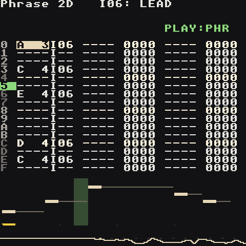

Under the grid is a piano roll of the whole bar: each note sits at its pitch, with a thin line until the next note or `KILL`. A playhead follows playback and an amber mark shows the step your cursor is on. The line at the very bottom is a live waveform of the output.

 

## Instrument (synth)

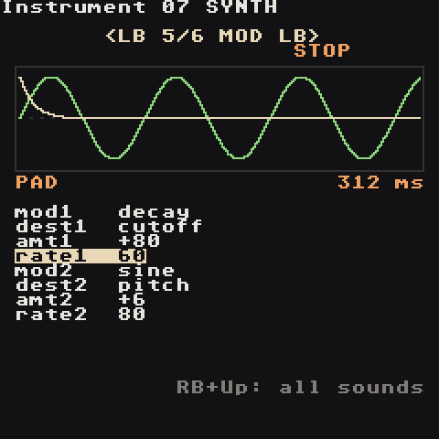
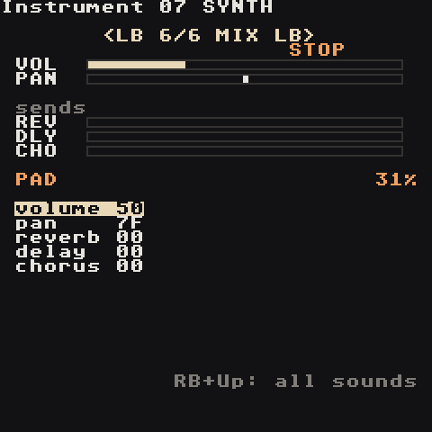
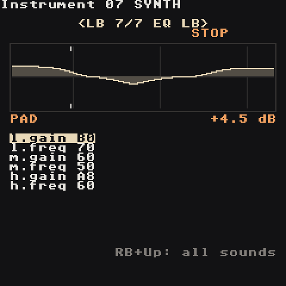

Seven pages (SOUND, ENV, FILTER, LFO, MOD, MIX, EQ), switched with **LB + Left/Right**. The top half draws what the page does — waveform, envelope, filter curve, LFO, modulation, levels, EQ curve — and shows the preset name and the focused value in real units (`32 ms`, `641 Hz`). The knobs are listed below. Full details on the **[Synth](Synth)** page.

The first row, `type`, switches the slot between **synth**, **sample** and **macro** — the [Macro Synth](Macro-Synth): 47 synthesis models played with two knobs, timbre and color. It has the same pages; SOUND and the 4th page (MOTION) are its own.

## Instrument list

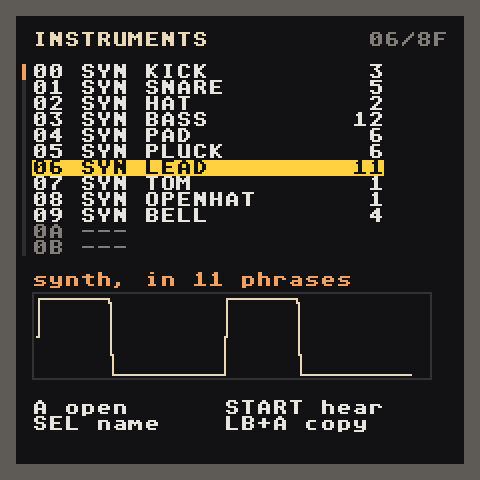

**RB + Up** on the Instrument screen opens every instrument at once: number, type (`SMP`, `SYN`, `MAC`, `MID`, `---` for an empty slot), name, and how many phrases use it. A green dot marks instruments that are playing right now, and the box underneath draws the selected sound: a sample's waveform, a synth's wave shape, or a macro synth's model output.

| Button | Does |
| --- | --- |
| Up / Down | pick an instrument (**Left/Right** jump a page) |
| A | open it on the Instrument screen |
| Start | hear it; Start again stops |
| Select | give it a name with the on-screen keyboard (clear the name to go back to the automatic one) |
| LB + A | copy it into the next free slot, to make a variation |
| B | back |

 

## Instrument (sample)

Sample instruments have seven pages too: Source, Shape, Filter, Loop, Mod, Motion, EQ, with a waveform and start/loop/end markers. See **[Samples](Samples)**.

## Table

Three command columns that step one row per tick and loop. Tables run on their own once triggered — by `TABL` in a phrase, or automatically by an instrument (`table` on the synth LFO page or the sample Motion page). Use them for arpeggios, stutters, pitch wobbles and filter wiggles you don't want to write note by note.

 

## Groove

How many ticks each step lasts, cycling. `06 06` is straight. `07 05` swings (long-short). `08 04` shuffles hard. Groove `00` is used by default; the `GROV` command switches a track to another groove.

The ruler on the right draws one bar twice: an even grid on top, and this groove underneath with each step as wide as its ticks. Late offbeats are the swing. Under it the feel is named in plain words (`straight`, `swing 58%`), and the step that's playing turns green.

 

## Project

| Field | What |
| --- | --- |
| Tempo | BPM |
| Master / Drive | output level / level into the soft clipper |
| Clip | soft clipper strength (Bypass … Insane) |
| Transpose | shifts every note in the song |
| Key / Scale / Notes | note-editing helper and sharp/flat spelling; **RB + Right** shows them on a keyboard ([Scale](#scale)) |
| Song List / Save Song / Save Song As | back to the song list (offers to save first), save, save a copy |
| Remove unused chains / sounds | tidy up chains, phrases and instruments nothing uses |
| Quit | leave the app (offers to save first) |
| Render | `Stereo` or `Stems`, then **Start** to export ([Export](Export)) |

 

## Scale

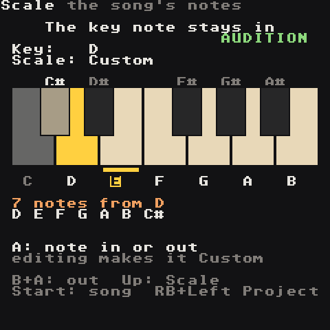

**RB + Right** from Project. The song's `Key` and `Scale` on top, one octave of piano keys below: the notes of the scale are lit, the key note is amber. Under the keyboard the scale is spelled out (`7 notes from D`, `D E F G A B C#`).

- **Up/Down** moves between `Key`, `Scale` and the keyboard; **A + D-pad** changes Key and Scale as on Project.
- On the keyboard, **Left/Right** picks a note and **A** puts it in or out of the scale (you hear it when it goes in). **B + A** takes it out. The key note always stays in.
- Editing a scale makes it the song's own `Custom` scale (the last one in the list), starting from the notes of the scale you had. It is saved with the song and moves with the Key.
- Phrase note editing (**A + Left/Right**), the random-notes tool (**LB + Right** on a selection) and `RAND` all stay on the lit keys. The `SCAL` command switches Key and Scale while the song plays ([Commands](Commands#from-the-m8)).

 

## Mixer

Faders for the 8 tracks, the three effect returns (**C** chorus, **D** echo, **R** reverb) and the master (**M**), each with a live level meter, plus the master waveform. Levels save with the song. When the [limiter](#limit) is on, a white line hangs from the top of the master meter as long as it is limiting (12 dB = half the meter), and the master line reads `LIM -3.2dB`.

| Input | Does |
| --- | --- |
| **Left/Right** | pick a strip |
| **A + Up/Down** | fader big step (`C0` = unity, up to `FF` for a boost) |
| **A + Left/Right** | fader fine step |
| **B + RB** / **A + RB** | mute / solo the track (**RB + LB** unmutes all) |
| **RB + Down** | FX screen |

 

## FX

The three effects every instrument can send to, each with a picture of what it does (**RB + Right** goes on to the [EQ](#eq)):

| Effect | Knobs | Picture |
| --- | --- | --- |
| Chorus | `speed` (0.1–5 Hz), `depth` (0.5–7.5 ms) | the left and right delay sweeps |
| Echo | `time` in 16ths (`3` = dotted 8th), `fdbk` repeats | the dry hit and each echo over two bars |
| Reverb | `size`, `damp` | the tail over four seconds; the bright line is the highs, which `damp` takes away faster |

Each heading shows the real values (Hz, ms, tail length) and how many sounds send to it. **Up/Down** walks the six knobs, **A + D-pad** edits. Turn up an instrument's `chorus`/`delay`/`reverb` send to hear it; the Mixer's C/D/R faders set how loud each effect comes back.

 

## EQ

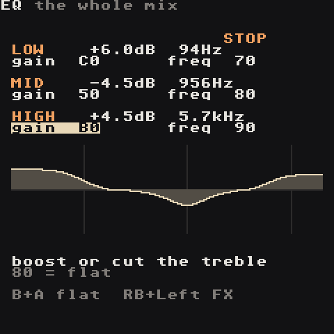

A three-band EQ on the whole mix, after the effects: **RB + Right** from FX.

| Band | Knobs | Shape |
| --- | --- | --- |
| LOW | `gain`, `freq` (30–400 Hz) | a shelf: everything below `freq` up or down |
| MID | `gain`, `freq` (150 Hz–6 kHz) | a wide bell around `freq` |
| HIGH | `gain`, `freq` (1.5–16 kHz) | a shelf: everything above `freq` |

`gain 80` is flat; each step is about 0.1 dB, from −12 to +12 dB. The heading shows the real values, and the curve underneath shows the result from 20 Hz to 20 kHz (marks at 100 Hz, 1 kHz, 10 kHz). **Up/Down** picks a knob, **A + D-pad** edits, **B + A** puts a knob back. It saves with the song; a flat EQ costs nothing.

Try: low `+3 dB` at 80 Hz for weight, mid `−3 dB` at 400 Hz to clear mud, high `+2 dB` at 8 kHz for air.

**RB + Right** goes on to the [limiter](#limit). Every instrument also has an EQ of its own, on its EQ page.

 

## Limit

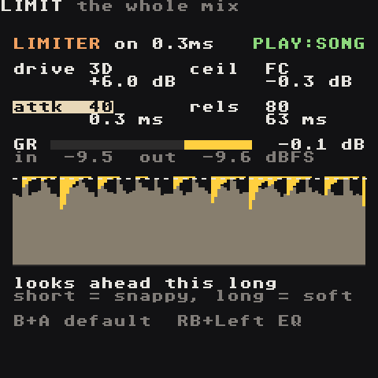

The master limiter, **RB + Right** from EQ (like the M8's `LIM`): it keeps the whole mix under a ceiling, so you can make it louder without it clipping. It comes after the EQ; the Project's `clip` (soft clip) and master volume come after it.

| Knob | Does | Values |
| --- | --- | --- |
| `drive` | pushes the mix into the limiter | `00` = **off** (the default), `01` = 0 dB .. `FF` = +25.4 dB |
| `ceil` | the loudest the mix may get | `00` = −25.5 dB .. `FF` = 0 dB, default `FC` = −0.3 dB |
| `attk` | how far it looks ahead: the gain is already down when a peak arrives | 0.1–10 ms, default `80` = 1 ms |
| `rels` | how fast it lets go afterwards | `00` = auto (100–900 ms: slower the harder it works), `01` = 4 ms .. `FF` = 1 s |

Under the knobs, the red **GR** bar shows how many dB it is taking off right now, with the peak going in (after drive) and coming out. The scope below scrolls the last few seconds: the mix level rises from the bottom, the limiting hangs from the top in red, the dotted line is the ceiling.

**Up/Down** picks a knob, **A + D-pad** edits, **B + A** puts a knob back (`drive` back to off), **RB + Left** returns to EQ. With `drive 00` the mix passes untouched; switched on, it delays the whole mix by the look-ahead (1 ms by default).

Try: `drive` +3 to +6 dB with `rels` on auto. A few dB of GR on the loudest hits is transparent; if it pumps, lower `drive` or lengthen `rels`.

 

## Helper (RB + Select)

Available on every screen, including dialogs. **Down/Up** flips between:

1. **Map** — where you are and where RB + direction goes, plus the undo keys
2. **Commands** — the buttons for this screen, then **MORE KEYS** with the rest. On the synth pages it also explains the knob under the cursor.
3. **How to** — a short walkthrough for this screen

On any page, **A** opens the built-in guide at the section for the current screen.

While the helper is open, other buttons are ignored, so you can't change anything by accident.
