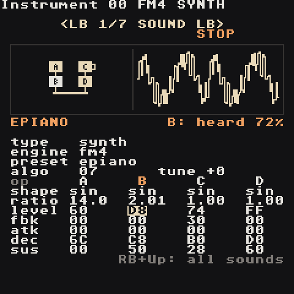
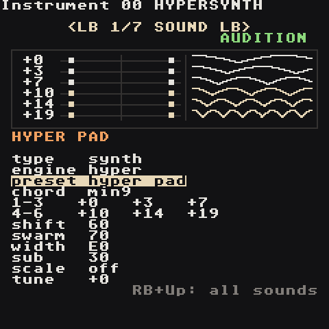
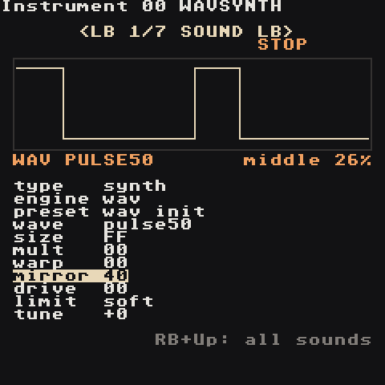

# Synth

Every instrument slot `00`–`7F` can be a **synth** or a **sample**. New projects fill `00`–`0F` with a ready synth kit. Open an instrument with **RB + Right** from a phrase; the cursor lands on `preset`, so **A + Left/Right** immediately flips through sounds and **A + Start** plays one (**Start** plays the phrase, as everywhere).

Each track plays one synth voice at a time. A note stopped by `KILL` or replaced by a different instrument fades out with its release instead of cutting off.

Want vowels, plucked strings, bells, 808 drums or wavetables? Set `type` to **macro**: the [Macro Synth](Macro-Synth) plays 47 ready synthesis models with two knobs, and keeps this page's ENV, FILTER, MOD, MIX and EQ pages.

## The starter kit

| Slot | Preset | Slot | Preset |
| --- | --- | --- | --- |
| `00` | **kick** — sine with a fast pitch drop and drive | `08` | **pluck** — bright saw that closes fast |
| `01` | **snare** — triangle body + noise | `09` | **keys** — FM electric piano with tremolo |
| `02` | **hat** — six metallic squares + noise, highpassed | `0A` | **bell** — FM bell, long ring |
| `03` | **openhat** — longer hat | `0B` | **acid** — resonant saw with glide |
| `04` | **clap** — bandpassed noise | `0C` | **subbass** — clean sine sub |
| `05` | **bass** — saw + sub, filter bite | `0D` | **chip** — 8-bit pulse |
| `06` | **lead** — pulse with vibrato and glide | `0E` | **tom** — pitched drum |
| `07` | **pad** — supersaw, slow attack, drifting filter | `0F` | **perc** — woodblock/rim |

`init` is a plain starting point for designing from scratch. Basses are tuned two octaves down, drums are tuned so `C 3` sounds right.

## Engines

The `engine` knob (SOUND page, under `type`) picks how the tone is made. The other five pages (ENV, FILTER, LFO, MOD, MIX) work the same for every engine, and so do the commands.

| Engine | Makes | Like the M8's |
| --- | --- | --- |
| `synth` | the original synth: waves, sub, noise, 2-operator FM, chords | — |
| `fm4` | four-operator FM: e-pianos, bells, brass, organs, slap bass | FM Synth |
| `hyper` | a six-note chord of detuned saw pairs, wide in stereo: pads, trance leads, hoovers | Hypersynth |
| `wav` | raw 8-bit shapes you bend: chip leads, PWM, sync and fold sounds | Wavsynth |

Changing the engine loads that engine's starting sound (`fm init`, `hyper init`, `wav init`); **A + Left/Right** on `preset` then browses only that engine's presets. **B + Select** undoes an engine change like any other edit.

| Engine | Presets |
| --- | --- |
| `fm4` | `epiano`, `fm bell`, `tubular`, `fm bass`, `slap bass`, `brass`, `organ`, `marimba`, `fm pluck`, `glass`, `fm lead`, `clav` |
| `hyper` | `hyper pad`, `trance lead`, `hoover`, `strings`, `stab`, `dream`, `hyper bass` |
| `wav` | `chip lead`, `chip bass`, `pwm pad`, `sync lead`, `fold bass`, `zap`, `lofi bell`, `noise hat` |

The LFO's `shape` target, and a MOD slot aimed at `shape`, mean something per engine: `fm4` — FM brightness (every modulator's depth), `hyper` — the swarm breathes, `wav` — the mirror moves (pulse-width modulation on `pulse50`). A MOD slot aimed at `fm` deepens every FM4 modulator (`+127` = twice as deep); one aimed at `noise` mixes noise into any engine.

### FM4 engine



Four sine operators **A B C D**. An operator either is **heard** (a carrier, it goes to the output) or **bends another one** (a modulator: the more level, the brighter and more metallic). `algo` picks who does what; the picture draws the routing: boxes on top modulate the boxes below them, the bottom ones feed the output bar. A filled box is sounding, the bright one is under the cursor, a hook on its side means feedback. Next to it: two cycles of the sound it makes.

| Knob | Does |
| --- | --- |
| `algo` | the routing, `00`–`0B` (below) |
| `tune` | semitones, like the synth's |
| `shape` | the operator's wave: `sin` (pure FM), `sw2` half sine, `sw3` two humps, `sw4` quarter sine, `sw5`/`sw6` double-speed halves, `tri`, `saw`, `squ`, `pul` (25%), `imp` (a click), `nse` (noise) |
| `ratio` | pitch against the note: `1.00` = the note, `2.00` = an octave up, `0.50` down. Whole ratios sound warm; `3.50`, `7.00`, `1.41` ring like bells. **A + Left/Right** ±0.01, **A + Up/Down** the next whole ratio |
| `level` | a carrier: how loud; a modulator: how much it bends (FM depth) |
| `fbk` | feedback: the operator modulates itself — sine, then saw, then noise |
| `atk` `dec` `sus` | the operator's own envelope: time to reach its level, time to fall, level it holds (`FF` = full). A modulator that decays fast = the "ping" of an e-piano; one that attacks slowly = a brass swell |

The grid has one column per operator: **Up/Down** stay in the column, **Left/Right** move between operators. The amp envelope on the ENV page still shapes the whole note.

| `algo` | Routing | | `algo` | Routing |
| --- | --- | --- | --- | --- |
| `00` | A>B>C>D | | `06` | [A>B>C]+[A>B>D] |
| `01` | [A+B]>C>D | | `07` | [A>B]+[C>D] — two pairs (e-piano) |
| `02` | [A>B+C]>D | | `08` | [A>B]+[A>C]+[A>D] |
| `03` | [A>B+A>C]>D | | `09` | [A>B]+[A>C]+D |
| `04` | [A+B+C]>D | | `0A` | [A>B]+C+D |
| `05` | [A>B>C]+D | | `0B` | A+B+C+D — additive: four tones, no FM (organ) |

`>` = modulates, `+` = both heard (or both modulate the same one).

**Try:** `fm init`, set C's `ratio` to `3.50` and raise C's `level` — a bell; shorten C's `dec` to `70` and it becomes a pluck.

<br clear="right">

### HYPER engine



Six notes at once, each played by **two saws** tuned slightly apart, spread left and right, plus a square sub. The picture has a lane per note: on the left the stereo field (its two saws as dots, pushed apart by `width`), on the right one second of how the pair beats (flat = in tune, more bumps = faster shimmer). Dim lanes are faded out by `shift`.

| Knob | Does |
| --- | --- |
| `chord` | fills the six notes: `unison`, `octaves`, `5th`, `major`, `minor`, `sus2`, `sus4`, `maj7`, `min7`, `dom7`, `maj9`, `min9`, `add9`, `min11`, `quartal`. Editing a note shows `custom` |
| `1-3` / `4-6` | the six notes, semitones above the one you play (`-24`…`+36`) |
| `shift` | fades from notes 1-3 (`00`) to notes 4-6 (`FF`); in between you hear both |
| `swarm` | how far apart each note's two saws are tuned, up to 60 cents: thicker, then seasick |
| `width` | `00` = mono, `FF` = one saw of each pair hard left, the other hard right |
| `sub` | square sub: `01`–`7F` two octaves down (louder as it rises), `80`–`FF` one octave down |
| `scale` | `on`: every note moves down onto the song's Key/Scale (Project screen), so any note you type gives an in-key chord |
| `tune` | semitones |

`CHRD` in a phrase replaces the six notes: its notes, then the same an octave up (`CHRD 0047` = `0 4 7 12 16 19`).

<br clear="right">

### WAV engine



A deliberately raw, 8-bit oscillator (no smoothing: it aliases like a game console). Pick a shape, then bend it; the picture shows the result through the drive stage.

| Knob | Does |
| --- | --- |
| `wave` | `pulse12`, `pulse25`, `pulse50`, `pulse75`, `saw`, `triangle`, `sine`, `tonenoise` (a looping noise pattern with a pitch), `noise` (8-bit noise, colour follows the note) |
| `size` | steps per cycle: `00` = 4 (crunchy) … `FF` = 256 (smooth) |
| `mult` | repeats the shape in one cycle, `x1`…`x16` — a hard-sync sound |
| `warp` | squeezes the shape into the start of the cycle, silence after — a hollow, vocal tone |
| `mirror` | moves the middle of the wave: on `pulse50` it is the pulse width (`80` = square), on the others it bends the shape |
| `drive` | the same drive as on the FILTER page |
| `limit` | what drive does when the wave gets too loud: `soft` saturation, `clip`, `sin` (smooth fold), `fold`, `wrap`. Applies to every engine |
| `tune` | semitones |

**Try:** `pwm pad` — the LFO moves `mirror`; `fold bass` — a sine with `drive 60` and `limit fold`.

<br clear="right">

## Pages and knobs

Switch pages with **LB + Left/Right**. Values are hex `00`–`FF` unless noted. The top of the page draws the result; press **RB + Select** for a plain-English explanation of the focused knob.

### SOUND — the raw tone


| Knob | Does |
| --- | --- |
| `type` | synth / sample |
| `engine` | how the tone is made: `synth`, `fm4`, `hyper`, `wav` (see [Engines](#engines)); the rows below are the `synth` engine's |
| `preset` | load a ready sound (overwrites the knobs) |
| `wave` | sine, triangle, saw, pulse, supersaw, noise, metal |
| `shape` | depends on the wave: sine → feedback (buzzier), triangle → wavefold, saw → octave brightness, pulse → width, supersaw → detune, noise → crunch, metal → spread |
| `sub` | square one octave below — fatter bass |
| `noise` | mixes white noise in — snares, breath |
| `fm` | FM depth: bells, keys, metallic tones |
| `ratio` | FM partner pitch: `1`, `2` warm; `3.5`, `7`, `11` bell-like |
| `chord` | play a chord from every note: 5th, octave, major, minor, sus2, sus4, maj7, min7, dom7 |
| `tune` | semitones, `-12` = an octave down |

<br clear="right">

### ENV — volume and pitch over time


| Knob | Does |
| --- | --- |
| `attack` | fade-in time |
| `decay` | time to fall to the sustain level |
| `sustn` | level while the note holds; `00` = pluck or drum |
| `releas` | fade after the note stops |
| `p.env` | pitch drop at note start, up to +48 semitones — kicks, toms, zaps |
| `p.dec` | how fast that pitch drop happens |
| `glide` | slide between notes (mono-synth legato); `00` = off |

Times are exponential: `00` = 1 ms, `40` = 10 ms, `80` = 100 ms, `C0` = 1 s, `FF` = 10 s.

<br clear="right">

### FILTER — bright or dark


| Knob | Does |
| --- | --- |
| `filter` | lowpass, highpass, bandpass, off |
| `cutoff` | 20 Hz – 20 kHz; lower = darker (lowpass) |
| `reso` | peak at the cutoff; high = squelch |
| `env` | brightness burst at each note (also drives FM brightness) |
| `envdec` | how fast the burst closes |
| `drive` | saturation before the filter — warmth, grit |

<br clear="right">

### LFO — wobble

| Knob | Does |
| --- | --- |
| `lfo` | what wobbles: pitch (vibrato), cutoff (wah), volume (tremolo), shape (PWM) |
| `rate` | `00` = 0.05 Hz … `80` = 1.6 Hz … `C0` = 9 Hz … `FF` = 50 Hz |
| `depth` | how much; `00` = off |
| `fine` | fine tune in cents |
| `auto` / `table` | an instrument table that runs on every note |

### MOD — 4 modulation slots


Four slots move the sound by themselves on every note, like the M8's modulation page: envelopes, LFOs and key tracking, each aimed at one part of the sound. Sample instruments have the same page, with their own destinations.

- The **top four lines** are the four slots at a glance: type, what it moves, how far, and a tiny curve. `>` marks the slot you are editing.
- The **box** draws that slot over real time from the note start (for `adsr` the dotted line is the note-off, for `track` the notes from low to high).
- The **settings below** belong to that slot only. Each shows its hex value and what it means: `A0 324 ms`, `80 1.60 Hz`, `80 50%`.

**LB + Up/Down** picks the slot (so does the `slot` setting). Changing `type` loads that type's starting values, ready to hear. **B + A** puts a setting back to its type's starting value (on `type`: off). Changes to a running slot are heard right away (a slot switched on starts with the next note); undo (**B + Select**) takes back a type change together with its values.

| Setting | Does |
| --- | --- |
| `slot` | which slot the settings below edit, 1–4 |
| `type` | `ahd`, `adsr`, `drum`, `lfo`, `trig`, `track` (and `decay`, `swell` from the first release); `off` |
| `dest` | what it moves (below) |
| `amount` | how far, `-127` … `+127`; minus goes the other way. Pitch: `+127` = 2 octaves; fine: `+127` = 1 semitone; others show a percentage |

| Type | Settings | What it does |
| --- | --- | --- |
| `ahd` | `attack` `hold` `decay` | rises to full, stays, falls back to nothing — on every note |
| `adsr` | `attack` `decay` `sustn` `releas` | stays at `sustn` while the note holds; `KILL` (or the next instrument on the track) starts the release |
| `drum` | `peak` `body` `decay` | a sharp peak, a short dip (`peak`: dip depth and time), then the body swells back, holds and decays — punchy drums |
| `lfo` | `rate` `shape` `trig` | repeating wobble; `rate` `00` = 0.05 Hz … `80` = 1.6 Hz … `FF` = 50 Hz |
| `trig` | `attack` `hold` `decay` `source` | an `ahd` fired by notes on another track (`source` = track 1–8) — sidechain ducking, call and response |
| `track` | `from` `to` `low` `high` | the note picks the value: `low` at the `from` note, `high` at the `to` note, in between for notes between |
| `decay` / `swell` | `rate` | the first release's envelopes, kept so older songs sound the same (`rate`: higher = faster) |

Envelope times: `00` = instant, `01` = 1 ms, `40` = 10 ms, `80` = 100 ms, `C0` = 1 s, `FF` = 10 s. The attack rises in a straight line, decays and releases fall fast then slow, landing on zero exactly at their time.

**LFO shapes:** `tri`, `sine`, `ramp dn`, `ramp up`, `exp dn`, `exp up`, `sqr dn`, `sqr up`, `random` (a new level every cycle — sample and hold), `drunk` (a random walk). **`trig`:** `free` keeps running across notes (every note joins it wherever it is), `retrig` restarts it with every note, `hold` plays one cycle and holds its last level, `once` plays one cycle and returns to its start.

**Destinations.** Synth: `volume`, `cutoff`, `reso`, `pitch`, `pan`, `fine`, `drive`, `shape`, `fm amt`, `noise`, `reverb`, `delay`, `chorus`. [Macro synth](Macro-Synth): `volume`, `cutoff`, `reso`, `pitch`, `pan`, `fine`, `drive`, `timbre`, `color`, `reverb`, `delay`, `chorus`. Sample: `volume`, `cutoff`, `reso`, `pitch`, `pan`, `fine`, `drive`, `crush`, `fb mix`, `fb tune`, `start`, `loop st`, `reverb`, `delay`, `chorus`.

- An **envelope on `volume`** shapes the note: `+127` follows the envelope from silence (an `adsr` becomes the note's own volume envelope), `-127` ducks the sound while the envelope is up. LFOs and tracking move the volume up and down around its level.
- On a sample, `start` moves where the note starts and `loop st` moves the loop start while it plays, `+127` = the whole trimmed sample. `crush` removes bits (`+127` = 15 bits fewer).
- A sample normally stops at `KILL`; with an `adsr` on `volume` (positive amount) it keeps playing and fades with the release.
- Every slot restarts with every note, with or without an instrument number on the step; `RTRG` restarts the envelopes too. Picking a preset switches all four slots off.

**Try:**

- `adsr` → `cutoff`, `amount +80`, `sustn 40`, `releas A0` — a filter that opens per note and closes after `KILL`.
- `lfo` → `pitch`, `amount +6`, `shape sine`, `trig retrig` — vibrato that starts fresh on every note.
- `drum` → `volume`, `amount +127` on a sample loop — a punchy, gated hit.
- `trig` → `volume`, `amount -100`, `source 1` on a pad — it ducks every time the kick on track 1 plays.
- `track` → `cutoff`, `low -40`, `high +40` — higher notes get brighter.

<br clear="right">

### MIX — level and space


| Knob | Does |
| --- | --- |
| `volume` | loudness (`VOLM` changes it per note) |
| `pan` | `00` left, `7F` centre, `FE` right |
| `reverb` | send to the shared reverb |
| `delay` | send to the shared echo |
| `chorus` | send to the shared chorus (width and shimmer) |

The reverb room, echo time and chorus speed are shared by every instrument and set on the [FX screen](Screens#fx) (Mixer, then **RB + Down**).

<br clear="right">

### EQ — its own tone


Every instrument has its own three-band EQ, like the M8's instrument EQ: the same low shelf, mid bell and high shelf as the [master EQ](Screens#eq), but only on this sound (before its pan and its effect sends). Sample instruments have the same page.

| Knob | Does |
| --- | --- |
| `l.gain` / `l.freq` | bass shelf: everything below `l.freq` (30–400 Hz) up or down |
| `m.gain` / `m.freq` | a wide bell around `m.freq` (150 Hz–6 kHz) |
| `h.gain` / `h.freq` | treble shelf: everything above `h.freq` (1.5–16 kHz) |

Gains: `80` = flat, −12 … +12 dB (about 0.1 dB a step). The curve shows the result from 20 Hz to 20 kHz, with a mark at the focused band; the focused knob shows its real value (`+4.5 dB`, `94 Hz`). **B + A** puts a knob back. A flat band costs nothing, so leave what you don't need at `80`. Picking a preset sets the EQ flat again.

**Try:** on a bass, `l.gain` `+4 dB` for weight and `h.gain` `−6 dB` to keep it out of the hats' way; on a pad, `m.gain` `−4 dB` around 400 Hz to leave room for the lead.

<br clear="right">

## Chords with CHRD

**How it works — two parts:**

- **The note you type picks WHICH chord.** Type `A 2` and you get an A chord.
- **The CHRD value picks WHAT KIND.** `0047` = major (happy), `0037` = minor (sad).

So `A 2` + `CHRD 0037` = **A minor**, and `F 2` + `CHRD 0047` = **F major**. The CHRD value on its own is never "A" or "F" — it's only major or minor.

**What the digits actually do:** each digit says "also play the note this many steps up from mine". `0037` on `A 2`:

```text
A                               <- your note
A  A# B  C                      <- 3 steps up:  C
A  A# B  C  C# D  D# E          <- 7 steps up:  E
                                   plays A + C + E = A minor
```

Count every key, black ones included (A → A# → B → C is 3 steps). Past 9 the digits are hex letters: `A` = 10, `B` = 11.

| Type this note | + CHRD `0037` plays | + CHRD `0047` plays |
| --- | --- | --- |
| `A 2` | A C E = **A minor** | A C# E = A major |
| `C 3` | C D# G = C minor | C E G = **C major** |
| `D 2` | D F A = **D minor** | D F# A = D major |
| `E 2` | E G B = **E minor** | E G# B = E major |
| `F 2` | F G# C = F minor | F A C = **F major** |
| `G 2` | G A# D = G minor | G B D = **G major** |

The **bold** ones are the chords that belong to A minor / C major — use those and it always sounds right.

More kinds, same idea (the note still picks which chord):

| CHRD | Kind | Sounds |
| --- | --- | --- |
| `0047` | major | happy, bright |
| `0037` | minor | sad, serious |
| `047B` | major 7 | dreamy, lo-fi |
| `037A` | minor 7 | smooth, jazzy |
| `047A` | dominant 7 | bluesy, wants to move on |
| `0057` | sus4 | open, unresolved |
| `0027` | sus2 | airy |
| `0007` | power chord | rock, neutral |

`CHRD` overrides the `chord` knob for that note. The `chord` knob does the same thing for every note of the instrument (pick `minor` and every note you type becomes a minor chord).

**Smoother changes (inversions):** a chord doesn't have to start on its own name. `C 3` + `0059` plays C F A — still an F major chord, just stacked differently — so moving from C major to F major barely moves your hand. Advanced; skip it until the basics feel easy.

## Recipes

Start from `init` (or the preset named) and set:

| Sound | Settings |
| --- | --- |
| **Deep 808 kick** | kick; `decay C0`, `p.env 80`, `drive 30` |
| **Punchy techno kick** | kick; `decay 98`, `p.dec 60`, `drive 90` |
| **Trap hat roll** | hat; in the phrase `RTRG 0002` on a note |
| **Reese bass** | wave supersaw, `shape 40`, `tune -24`, `sub 60`, lowpass `cutoff 60`, `drive 40` |
| **Acid line** | acid; write 16ths, raise `reso`, automate with `FCUT` |
| **Plucky arp** | pluck; `delay 60` on MIX, FX `time 3/16` |
| **Warm pad** | pad; `chord minor`, `attack C0`, `releas C8`, `reverb A0` |
| **Glassy bell** | bell; `ratio 7`, `env A0`, `reverb 90` |
| **Flute** | wave sine, `noise 28`, `attack 38`, `lfo pitch`, `rate B0`, `depth 18` |
| **Bowed string (erhu)** | wave saw, lowpass `cutoff 90`, `attack 58`, `glide 50`, vibrato `depth 20` |
| **Chip arpeggio** | chip; in the phrase `ARPG 0047` on a held note |
| **Gong** | wave metal, `tune -24`, lowpass `cutoff 90`, `reso 40`, `decay E0`, `reverb 90` |

## Commands synths understand

`VOLM` `PAN_` `FCUT` `FRES` `FLTR` `PTCH` `LEGA` `PFIN` `ARPG` `RTRG` `CRSH` (drive) `KILL` `TABL` `DLAY` `CHRD` — see [Commands](Commands). `RTRG` restrikes the envelopes, great for rolls and tremolo.
