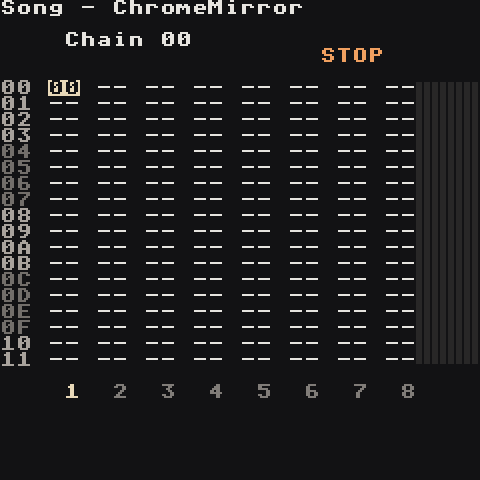
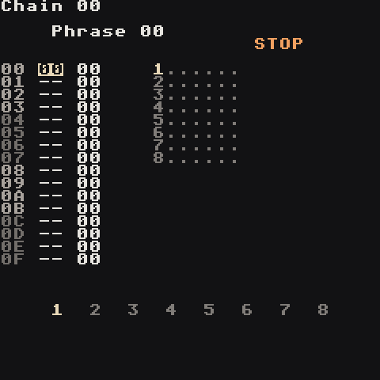
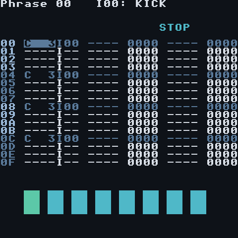
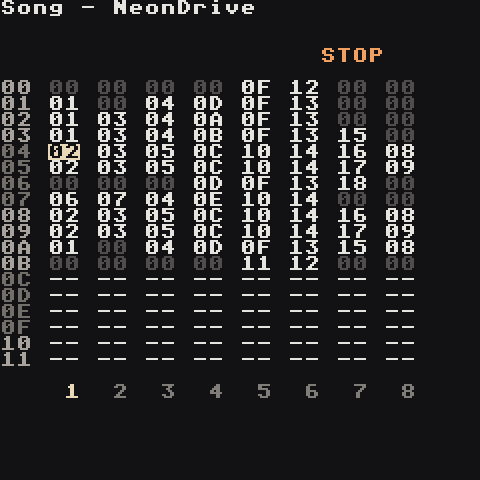

# Your First Song

Ten minutes, device in hand. You'll start from the very first screen, make a beat, add a bassline and chords, then turn the loop into a song. Every step uses the synth kit that comes with a new project, so you don't need any samples.

## 1. The start screen

Launching the app shows **Your Songs**. **Up/Down** picks a song, **Left/Right** picks a button along the bottom, **A** runs it. The line under the buttons says what **A** will do. Songs you opened most recently are at the top; **Select** switches the list to A to Z and back (the top right corner says which).


Not sure what anything means? Pick **Help**: this whole guide is built into the app. **Up/Down** picks a topic, **A** opens it. Inside a page **Up/Down** scrolls, **Left/Right** jumps between sections, **B** goes back to the topics.

 

Every screen in the app sits on a **map**, and you move between them by holding **RB** and pressing a direction:

```text
PROJ         GROOVE
 |             |
SONG>CHAIN>PHRASE>INSTR
 |             |
MIXER        TABLE
```

## 2. Make a new song

Move to **New** and press **A**.


A random free name is already filled in and **DONE** is highlighted, so pressing **A** now is fine. To use your own name, press **Down** into the keyboard and type with **A** (**Select** switches to lowercase): the first letter replaces the suggestion, **B** erases, **Start** creates the song. **B** on an empty name (or `CANCEL`) takes you back without making anything.

You land on the **Song** screen: 8 empty tracks.


## 3. Your map on every screen

Hold **RB** and press **Select** (the `FN` key). This helper works on every screen, including the start screen:


- Page 1, **MAP**: where you are (highlighted) and where **RB + direction** goes from here.
- **Down**: page 2, every button on this screen.
- **Down** again: page 3, **HOW TO** — a tiny walkthrough for this screen.
- **A**: opens this guide at the page for the screen you're on.
- **RB + Select** again closes it.

Whenever you're unsure, open it. The rest of this guide tells you which screen you're on so you can follow along on the map.

## 4. A kick drum

1. The cursor is on row `00`, track 1. Press **A** → `00` appears: chain 00 now plays on track 1.

   

2. **RB + Right** opens chain 00 (one step right on the map). Press **A** → phrase `00`.

   

3. **RB + Right** opens phrase 00. Press **A** on row `00`: a note `C 3` with instrument `I00` appears — that's **KICK**. Move to rows `04`, `08`, `0C` and press **A** on each.

   

4. Press **Start**. Four kicks on the beat, looping. **Start** again to stop.

That's "four on the floor", the backbone of house, disco and synthwave.

## 5. Snare and hats on their own tracks

Each track plays one sound at a time, so drums get a track each.

1. **RB + Left** twice → Song. Move **Right** to track 2 and press **A**. The screen says `Reused 00`: one **A** repeats the last chain, handy when you want the same part again. Press **A** once more for `New chain 01`.

   > **One A = reuse. A A = new.** Same on the Chain screen with phrases.

2. **RB + Right**, **A A** (`New phrase 01`), **RB + Right**.
3. Add notes on rows `04` and `0C` — beats 2 and 4. Move **Right** to the instrument column and hold **A + Right** until it reads `I01: SNARE`. New notes now copy `01`.
4. Track 3: same again with instrument `02` (HAT) on rows `00 02 04 06 08 0A 0C 0E`.
5. Back on **Song**, press **Start**. All three tracks play together because they sit on the same Song row.

> **Make hats breathe:** on every other hat, put `VOLM 0060` in the first command column (**Select** opens the command picker). Quieter off-beats sound human.

## 6. A bassline

1. Track 4, new chain, new phrase, instrument `05` (BASS).
2. Put notes on rows `00`, `06`, `0A`. On a note, **A + Left/Right** moves a semitone, **A + Up/Down** an octave. Try `A 2`, `A 2`, `C 3`.
3. The bass rings until the next note. Put `KILL 0000` on a row to stop it early — short notes make a bassline bounce.

> **Stay in key without thinking:** Project screen → `Key: A`, `Scale: Aeolian mode (minor)`. Now **A + Left/Right** only walks through notes that fit. **LB + D-pad** escapes the scale for one note.

## 7. Chords from one note

Tracks are one note at a time, but the synth can play a chord from a single note with the `CHRD` command.

**How it works — two parts:**

- **The note you type picks WHICH chord.** Type `A 2` and you get an A chord.
- **The CHRD value picks WHAT KIND.** `0047` = major (happy), `0037` = minor (sad).

So `A 2` + `CHRD 0037` = **A minor**, and `F 2` + `CHRD 0047` = **F major**. The CHRD value on its own is never "A" or "F" — it's only major or minor.

**What the digits actually do:** each digit says "also play the note this many steps up from mine". `0037` on `A 2`:

```text
A                               <- your note
A  A# B  C                      <- 3 steps up:  C
A  A# B  C  C# D  D# E          <- 7 steps up:  E
                                   plays A + C + E = A minor
```

Count every key, black ones included (A → A# → B → C is 3 steps). Past 9 the digits are hex letters: `A` = 10, `B` = 11.

| Type this note | + CHRD `0037` plays | + CHRD `0047` plays |
| --- | --- | --- |
| `A 2` | A C E = **A minor** | A C# E = A major |
| `C 3` | C D# G = C minor | C E G = **C major** |
| `D 2` | D F A = **D minor** | D F# A = D major |
| `E 2` | E G B = **E minor** | E G# B = E major |
| `F 2` | F G# C = F minor | F A C = **F major** |
| `G 2` | G A# D = G minor | G B D = **G major** |

The **bold** ones are the chords that belong to A minor / C major — use those and it always sounds right.

**Try it:**

1. Track 5, new chain, new phrase, instrument `07` (PAD).
2. On row `00` add `A 2`, move to the first command column, **Select** → `CHRD`, and set it to `0037`. You hear A minor.
3. Make three more phrases in the same chain for a four-bar progression:

| Bar | Note (which chord) | CHRD (what kind) | You hear |
| --- | --- | --- | --- |
| 1 | `A 2` | `0037` minor | A minor |
| 2 | `F 2` | `0047` major | F major |
| 3 | `C 3` | `0047` major | C major |
| 4 | `G 2` | `0047` major | G major |

`Am F C G` — one of the most-used progressions in pop and synthwave. Give the bass the same notes (`A F C G`) and it all locks together.


## 8. From loop to song

A **chain** can list up to 16 bars. A **Song row** is a section. A classic map, one row each:

```text
00  intro    pad
01  verse    drums + bass + pad
02  verse    + melody
03  chorus   everything, busier drums
04  break    drums drop out
05  chorus   again
06  outro    pad fading out
```

- Keep every chain on a row the **same length** (for example 4 phrases) so tracks stay in sync.
- To silence a track for a section, give it a chain of empty phrases with `KILL 0000` on the first step.
- Copy a chain with **B + LB** then **A + LB** (clone) and change a few notes for variation.



## 9. Make it sound finished

- **Space:** on each instrument's **MIX** page, turn up `reverb` on snare and pads, `delay` on leads.
- **Balance:** kick and bass loudest, snare just under, hats and pads quieter. Watch the [Mixer](Screens#mixer).
- **Movement:** `FCUT 60C0` on the first note of a pluck part slowly opens its filter over 4 bars.
- **Save:** Project screen → **Save Song**. **Export** to WAV: see [Export](Export).

## Next

- Open the [Demo Songs](Demo-Songs) and change things.
- Learn the knobs in [Synth](Synth).
- Keep the [Music Theory Cheat Sheet](Music-Theory-Cheat-Sheet) nearby.
