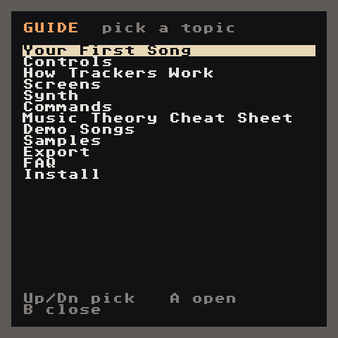
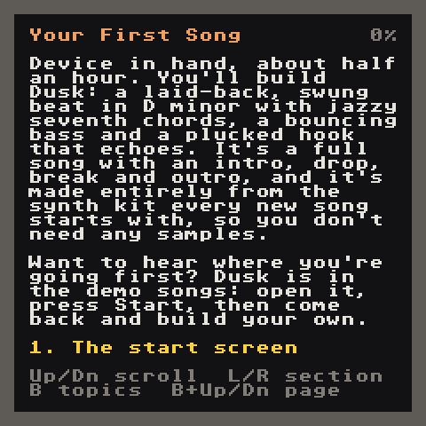
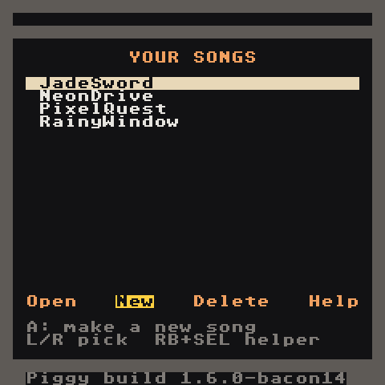
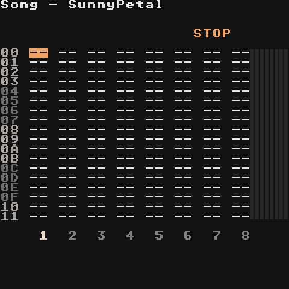
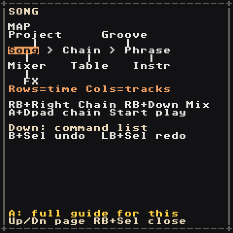
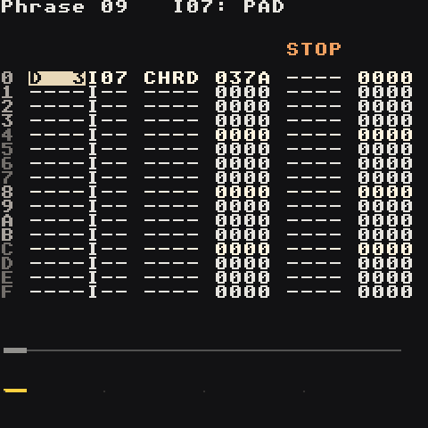
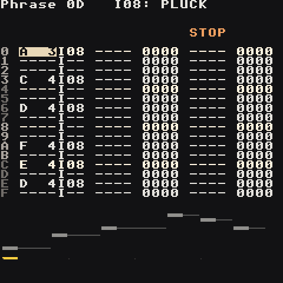
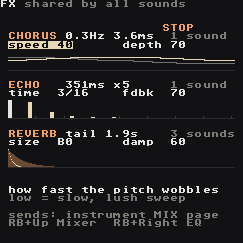
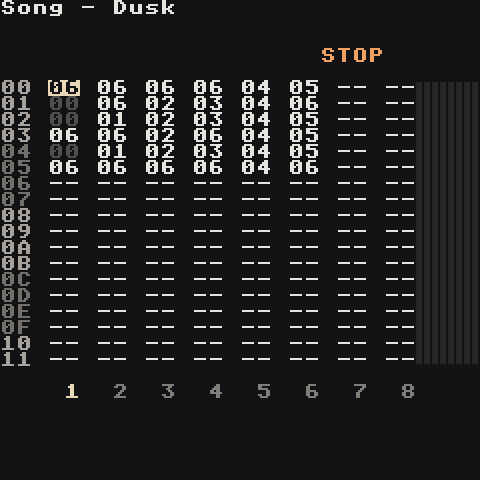

# Your First Song

Device in hand, about half an hour. You'll build **Dusk**: a laid-back, swung beat in D minor with jazzy seventh chords, a bouncing bass and a plucked hook that echoes. It's a full song with an intro, drop, break and outro, and it's made entirely from the synth kit every new song starts with, so you don't need any samples.

Want to hear where you're going first? **Dusk** is in the demo songs: open it, press **Start**, then come back and build your own.

## 1. The start screen

Launching the app shows **Your Songs**. **Up/Down** picks a song, **Left/Right** picks a button along the bottom, **A** runs it. The line under the buttons says what **A** will do. Songs you opened most recently are at the top; **Select** switches the list to A to Z and back (the top right corner says which).


Not sure what anything means? Pick **Help**: this whole guide is built into the app. **Up/Down** picks a topic, **A** opens it. Inside a page **Up/Down** scrolls, **B + Up/Down** turns a page, **Left/Right** jumps between sections, **B** goes back to the topics.

 

Every screen in the app sits on a **map**, and you move between them by holding **RB** and pressing a direction:

```text
PROJ         GROOVE
 |             |
SONG>CHAIN>PHRASE>INSTR
 |             |
MIXER        TABLE
 |
FX
```

## 2. Make a new song

Move to **New** and press **A**.




A random free name is already filled in and **DONE** is highlighted, so pressing **A** now is fine. To use your own name, press **Down** into the keyboard and type with **A** (**Select** switches to lowercase): the first letter replaces the suggestion, **B** erases, **Start** creates the song. **B** on an empty name (or `CANCEL`) takes you back without making anything.

You land on the **Song** screen: 8 empty tracks.



## 3. Your map on every screen

Hold **RB** and press **Select** (the `FN` key). This helper works on every screen, including the start screen:



- Page 1, **MAP**: where you are (highlighted) and where **RB + direction** goes from here.
- **Down**: page 2, every button on this screen.
- **Down** again: page 3, **HOW TO** — a tiny walkthrough for this screen.
- **A**: opens this guide at the page for the screen you're on.
- **RB + Select** again closes it.

Whenever you're unsure, open it. The rest of this guide tells you which screen you're on so you can follow along on the map.

## 4. Set the tempo and key

**RB + Up** → Project.

- `Tempo`: hold **A** and use **Left/Right** (and **Up/Down** for bigger steps) until it reads `88`. Slow and relaxed.
- `Key: D`, `Scale: Aeolian mode (minor)`. From now on, editing a note only walks through notes of D minor, so it's hard to hit a wrong one.

**RB + Down** back to Song.

## 5. How to read the phrases below

A phrase is one bar of 16 steps, numbered `0`–`F`. This guide writes a phrase as one line per step that has something on it:

```text
0  D 3  I05
6  D 3
A  D 4
C  ----       KILL 0000
```

- **Add a note:** move to the step and press **A**. It copies the last note and instrument you used.
- **Change it:** hold **A** and press **Left/Right** (a semitone, or a scale step while the Key is set) or **Up/Down** (an octave).
- **Delete:** **B + A**.
- **Commands:** move **Right** to the command column, press **Select**, pick the command, then hold **A**: **Left/Right** picks a digit, **Up/Down** changes it.

The steps you leave empty are silence (or the last note ringing on).

## 6. Drums

### Kick, track 1

1. On the **Song** screen, cursor on row `00` track 1, press **A** → chain `00`. **RB + Right** into it.
2. On the **Chain**, press **A** on row `0` → phrase `00`. **RB + Right** into it.
3. Enter this. **A** on an empty step gives `C 3` with instrument `I00` (KICK):

   ```text
   0  C 3  I00
   6  C 3
   A  C 3
   ```

   Press **Start** to hear it, **Start** again to stop. The kick on step `6` comes early, just before beat 3, and that's what makes it bounce.

4. **RB + Left** back to the chain. Press **A** on rows `1` and `2` (one **A** reuses phrase `00`), then **A A** on row `3` for a new phrase `01`. Open it and give bar 4 an extra kick to push into the next loop:

   ```text
   0  C 3  I00
   6  C 3
   A  C 3
   E  C 3
   ```

### Snare, track 2

On the Song screen, track 2, **A A** for a new chain `01`. In it: **A A** for phrase `02` on row `0`, **A** on rows `1` and `2`, **A A** on row `3` for phrase `03`.

Phrase `02`: the backbeat. Set the instrument to `I01` (SNARE) on the first note with **A + Right** in the instrument column; the second note copies it.

```text
4  C 3  I01
C  C 3
```

Phrase `03`: the same, plus two quiet notes at the end, a little drummer's flourish:

```text
4  C 3  I01
C  C 3
E  C 3        VOLM 0050
F  C 3        VOLM 0070
```

### Hats, track 3

New chain `02` with the same new phrase `04` on all four rows (**A A** on row `0`, then **A** on rows `1`–`3`).

```text
0  C 3  I02
2  C 3        VOLM 0060
4  C 3
6  C 3        VOLM 0060
8  C 3
A  C 3        VOLM 0060
C  C 3
E  C 3  I03
```

The quiet off-beats make the hats breathe. Step `E` switches to `I03` (OPENHAT): a track plays one sound at a time, but every note can pick its own instrument.

Back on the **Song** screen, **Start**: three tracks, one groove.

## 7. The chords

Four bars, one chord each: **Dm7, Bbmaj7, Gm7, A7**. The seventh chords give it that warm, jazzy, lo-fi colour; the A7 at the end pulls you back to the start every time.

A track plays one note at a time, but the `CHRD` command turns one note into a whole chord. **The note picks which chord** (its root). **The value picks what kind**: each digit adds a note that many semitones above.

| Value | Adds | Kind |
| --- | --- | --- |
| `037A` | +3, +7, +10 | minor 7th |
| `047B` | +4, +7, +11 | major 7th |
| `047A` | +4, +7, +10 | dominant 7th |

Track 5, new chain `04`, four **new** phrases `09`–`0C` (**A A** on each row). Each is a single step:

| Phrase | Step 0 | Command | You hear |
| --- | --- | --- | --- |
| `09` | `D 3  I07` | `CHRD 037A` | D minor 7 |
| `0A` | `A#2  I07` | `CHRD 047B` | Bb major 7 |
| `0B` | `G 2  I07` | `CHRD 037A` | G minor 7 |
| `0C` | `A 2  I07` | `CHRD 047A` | A7 |

`I07` is the PAD. It holds each chord until the next one.



## 8. The bass

Track 4, new chain `03`, four new phrases `05`–`08`, instrument `I05` (BASS). The bass hits with the kick (steps `0`, `6`, `A`), jumps an octave for the last one and is cut short with `KILL`, so it bounces instead of droning:

| Phrase | 0 | 6 | A | C | E |
| --- | --- | --- | --- | --- | --- |
| `05` | `D 3` | `D 3` | `D 4` | `KILL 0000` | |
| `06` | `A#2` | `A#2` | `A#3` | `KILL 0000` | |
| `07` | `G 2` | `G 2` | `G 3` | `KILL 0000` | |
| `08` | `A 2` | `A 2` | `A 3` | `KILL 0000` | `C#3` |

That last `C#3` walks up into the `D` when the loop starts again. It's outside the scale, so hold **LB** while you edit it (**LB + D-pad** steps by semitones).

Put the cursor on the Song screen's row `00` and press **Start**. That's a groove.

## 9. The hook

Track 6, new chain `05`, four new phrases `0D`–`10`, instrument `I08` (PLUCK). A short tune that answers itself:

| Step | `0D` (Dm7) | `0E` (Bbmaj7) | `0F` (Gm7) | `10` (A7) |
| --- | --- | --- | --- | --- |
| 0 | `A 3` | | `A 3` | `E 4` |
| 3 | `C 4` | | `C 4` | |
| 4 | | `D 4` | | `C#4` |
| 6 | `D 4` | | `D 4` | |
| 8 | | `C 4` | | |
| A | `F 4` | | `F 4` | `A 3` |
| C | `E 4` | `A 3` | `G 4` | |
| E | `D 4` | | `F 4` | `KILL 0000` |



## 10. Space: echo, reverb, chorus

Right now everything is dry. Three sends make it sound like a record.

1. Go to an instrument: in a phrase, put the cursor on a note and press **RB + Right**. **LB + Left/Right** flips pages; the last one is **MIX**.
   - **PLUCK** (`I08`): `delay 60`, `reverb 40`. The hook now echoes on the off-beat.
   - **PAD** (`I07`): `reverb 90`, `chorus A0`. The chords get wide and shimmery.
   - **SNARE** (`I01`): `reverb 60`.
2. **RB + Down** from the Song screen → Mixer, **RB + Down** again → **FX**. This is where the shared effects live. The echo is already `time 3/16`, a dotted 8th that bounces nicely against the beat. The heading shows how many sounds use each effect.



## 11. Swing

**RB + Up** from a phrase → **Groove**. Change `06 06` to `07 05`: every other step is a bit late. The whole song relaxes into a lazy, head-nodding feel.

## 12. From loop to song

Now you have a four-bar loop with six parts. A song is that loop with parts coming in and dropping out. Each **Song row** is one pass of the loop.

First make one more chain for silence: on track 1, row `05`, **A A** for chain `06`. Give it the same new phrase `11` on all four rows, with just `KILL 0000` on step `0`. Any track that plays chain `06` goes quiet.

Then fill the Song screen like this. On a cell, **A + Up/Down** changes the chain number; **A** on an empty cell reuses the last one.

```text
     1  2  3  4  5  6
00  06 06 06 06 04 05    intro: chords and hook
01  00 06 02 03 04 06    groove: beat and bass come in
02  00 01 02 03 04 05    drop: everything
03  06 06 02 06 04 05    break: kick and bass drop out
04  00 01 02 03 04 05    drop again
05  06 06 06 06 04 06    outro: just the chords
```

Row `00` used to hold the whole loop; now it's the intro, so change its drum and bass cells to `06`.



Cursor on row `00`, **Start**. That's Dusk: about a minute that loops forever.

## 13. Finish it

- **Headroom:** Project screen → `Drive: 70`, `Clip: Subtle`. Six parts add up; this keeps the loudest moments from crackling.
- **Balance:** **RB + Down** → Mixer. The kick and bass should be loudest. If the hook is too loud, move to strip `6`, **A + Down**. Levels save with the song.
- **Save:** Project screen → **Save Song**.
- **Export** a WAV to share: see [Export](Export).

## Make it yours

- **Swap the kit for real drums:** open the kick instrument, set `type` to **sample**, move to `sample` and press **Select**, open `drums-dusty` and import `kick.wav`. Same for the snare and hats. Or try `drums-808` for a harder sound. See [Samples](Samples).
- **Change the mood:** on the chord phrases, `037A` → `037E` (minor add9) or `047B` → `047E` (major add9) gives dreamier chords.
- **Jam it live:** on the Song screen press **Select** for Live mode. **Start** on a cell cues it, **LB + Start** cues a whole row: loop the break, drop back into the drop when it feels right. See [Controls → Live mode](Controls#live-mode).
- **Chop it:** on a phrase, **LB + Start** records it into a new sample ([render to sample](Samples#render-to-sample)). Play it backwards or slice it for a fill.
- Open the other [Demo Songs](Demo-Songs) and see how they're built. Keep the [Music Theory Cheat Sheet](Music-Theory-Cheat-Sheet) nearby.
